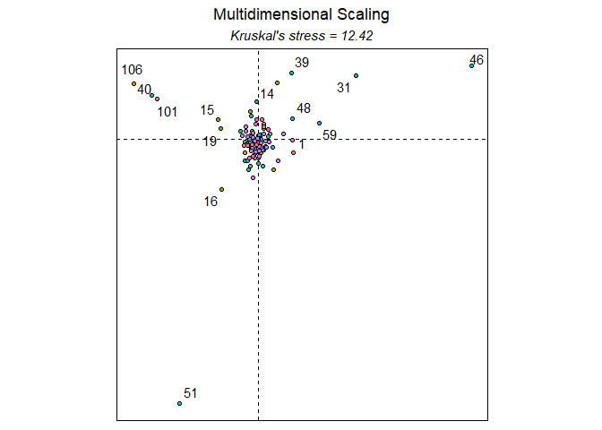
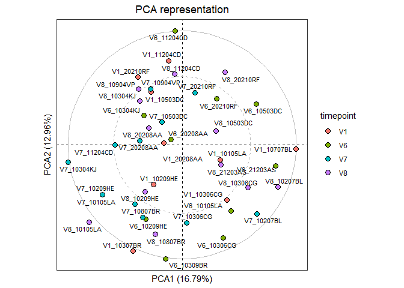
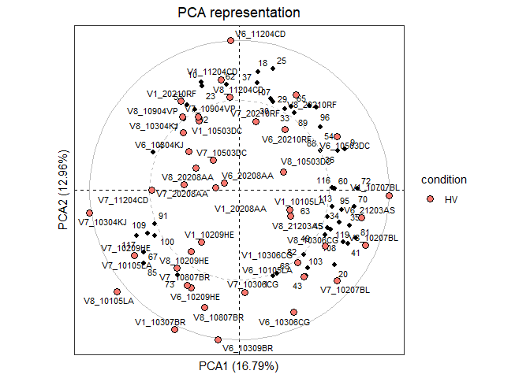

# 1. Introduction

Cytometry data are now classically analyzed using non-linear
dimensionality reduction approaches, but it is still challenging to
easily handle the whole pipeline of computational analyses.

UMAPVizR allows the statistical analysis and visualization of
high-dimensional cytometry data using manifold algorithms and clustering
methods. Especially, several key analysis steps are available to perform
data importation, manifold generation, cell cluster identification,
statistical analyses, cluster visualization, and quality controls of
generated results.

UMAPVizR can import cell events from FCS or txt file formats using
different transformation, down-sampling, and normalization approaches.
Manifold representations can be generated using the UMAP, tSNE or
LargeVis algorithms to project cell events into a lower dimensionality
space. Cell clusters can be identified using multiple clustering
algorithms, depending on the user’s assumptions. The characteristics of
cell clusters can be visualized using scatter plots, categorical heatmap
of marker expressions, or using parallel coordinates representations.
Cell clusters having abundances differently expressed between biological
conditions can be identified using several statistical tests.
Statistical results can be visualized using volcano plots or heatmaps.

## 1.1 Overview of Workflow

In `UMAPVizR` workflow, an S4 object in R to implement progressively to
contain the main information of the files used. This stored information
will allow realizing the statistics and visualization part of the
dataset.


*Figure 1: Workflow of UMAPVizR* *It consists of three main steps: (1)
importing the data in FCS or txt format resulting in the creation of an
S4 UMAPdata object, (2) adding the metadata to the UMAPdata object, (3)
generating the manifold and clustering. The results can be (4)
visualised in different ways and (5) differential analyses are
possible.*

## 1.2 Input data

The following conditions must be respected to analyse the data with
`UMAPVizR`:

-   **Type and format of data**: The biological data that can be
    explored and integrated with `UMAPVizR` are flow, mass or spectral
    cytometry data. The input files can be in standard cytometry format
    (FCS) or txt format.
-   **Compensation**: Before starting an analysis with `UMAPVizR` it is
    necessary to perform the compensation steps for flow cytometry and
    spectral data with conventional methods (FlowJo or Kaluza).
-   **Cleaning and gating**: It is recommended to perform data cleaning:
    to remove debris, dead cells and doublets. You can then perform a
    pre-gating on a large population of interest, e.g.lymphocytes, to
    make the use of `UMAPVizR` more optimal.

# 2. Quick start

## 2.1 Installation

To download `UMAPVizR` it is required `devtools`:

``` r
install.packages("devtools")
library("devtools")
install_github("tchitchek-lab/UMAPVizR")
```

The `UMAPVizR` package automatically downloads the necessary packages
for its operation such as: `coin`, `concaveman`, `dendextend`,
`flowCore`, `ggdendro`, `gglot2`, `gridExtra`, `MASS`, `plyr`,
`reshape`, `reshape2`, `rstatix`, `Rtsne`, `scales`, `stats`, `stringr`,
`uwot`. If not, the packages are available on the `CRAN`, except
`flowCore` which is available on `Bioconductor`.

Once installed, `UMAPVizR` can be loaded using the following command:

``` r
library("UMAPVizR")
```

## 2.2 Importing data

The first function of the package to use is the `import` function which
allows importing the expression matrix of the files in the `UMAPdata`
object.

The files to be analysed must be in FCS or txt format. The function is
used as below:

``` r
# creation of a vector containing the names of the files 

files <- list.files("C:/Users/GWMA/Documents/Transreg/03_Kaluza_exports_renamed/Panel_03_NK/", 
                    pattern = "fcs", full.names = TRUE)

# import the FCS files  
UMAPV <- import(files, 
                filetype = "fcs", 
                transform = "logicle", 
                exclude.markers = c("FS","FS.1","FS.2", "SS","SS.1","SS.2", "Time"), 
                downsampling = 5000)
```

The main arguments of the `import` function are:

-   the `filetype` argument allows you to define the type of format
    which is used for the data,
-   the `transform` argument allows you to choose the type of
    transformation to be used on the data. Advice: For flow cytometry,
    data use a `logicle` transform and for mass cytometry data use an
    `arcsinh` transform,
-   the `exclude_markers` argument is used to remove the channels not to
    be used for the analysis.

## 2.3 Assign metadata

The metadata can be assigned to each sample in the dataset. The
different viewers associate samples with specific biological conditions
or individuals using this metadata. The metadata file must contain
exclusively the following column names:

-   individual: corresponds to the sample identifier,
-   condition: corresponds to the biological condition of the sample,
-   timepoint: corresponds to the timepoint of the sample (optional).

To do this, follow the instructions below:

``` r
# creation of the dataframe 
metadata <- data.frame("individual"= c("10105LA","10209HE","10306CG","10307BR","10503DC",
                                       "10707BL","11204CD","20208AA","20210RF",
                                       "10105LA","10209HE","10304KJ","10306CG","10309BR",
                                       "10503DC","11204CD","20208AA","20210RF",
                                       "21203AS",
                                       "10105LA","10207BL","10209HE","10304KJ","10306CG",
                                       "10503DC","10807BR","10904VP","11204CD","20208AA",
                                       "20210RF",
                                       "10105LA","10207BL","10209HE","10304KJ","10306CG",
                                       "10503DC","10807BR","10904VP","11204CD","20208AA",
                                       "20210RF","21203AS"),
                       "condition"= rep("HV", 42),
                       "timepoint"= c(rep("V1", 9), rep("V6", 10), rep("V7", 11), rep("V8", 12))
)

rownames(metadata) = paste0(metadata$timepoint,"_", metadata$individual)

# assign the dataframe 
UMAPV <- assignMetadata(UMAPV, metadata = metadata)
```

## 2.4 Manifold construction and clustering

If the marker names are not the same for each sample (refer to point 3
to check), they can be corrected as below:

``` r
# Rename markers if necessary
UMAPV <- renameMarkers(UMAPV, marker.names = c("TCRgd", "NKP44", "HLADR", "NKp30", "NKp46",
                                               "NKG2D", "CD3", "CD16", "CD56", "CD8"))
```

This part consists of two steps. The first step is to perform the
manifold on the dataset by following the instructions below:

``` r
# Perform Manifold from the "UMAPdata" object
UMAPV <- generateManifold(UMAPV, 
                          markers = c("TCRgd", "NKP44", "HLADR", "NKp30", "NKp46",
                                      "NKG2D", "CD3", "CD16", "CD56", "CD8"), 
                          type = "UMAP", 
                          n_neighbors = 15,
                          n_components = 2,
                          metric = "euclidean",
                          n_epochs = NULL,
                          n_threads = 40, 
                          n_sgd_threads = 1,
                          scale = FALSE)
```

    ## Manifold markers are: TCRgd, NKP44, HLADR, NKp30, NKp46, NKG2D, CD3, CD16, CD56, CD8

    ## 16:56:21 UMAP embedding parameters a = 1.896 b = 0.8006

    ## 16:56:21 Read 193322 rows and found 10 numeric columns

    ## 16:56:21 Using Annoy for neighbor search, n_neighbors = 15

    ## 16:56:22 Building Annoy index with metric = euclidean, n_trees = 50

    ## 0%   10   20   30   40   50   60   70   80   90   100%

    ## [----|----|----|----|----|----|----|----|----|----|

    ## **************************************************|
    ## 16:56:37 Writing NN index file to temp file C:\Users\GWMA\AppData\Local\Temp\RtmpmIkY0J\file1cc0551d85c
    ## 16:56:38 Searching Annoy index using 40 threads, search_k = 1500
    ## 16:56:47 Annoy recall = 100%
    ## 16:56:47 Commencing smooth kNN distance calibration using 40 threads
    ## 16:56:51 Initializing from normalized Laplacian + noise
    ## 16:56:57 Commencing optimization for 200 epochs, with 3859266 positive edges using 1 thread
    ## 16:59:15 Optimization finished

The main arguments of the `generateManifold` function are:

-   the `markers` argument is used to specify the markers to use for the
    manifold generation,
-   the `type` argument is used to specify the clustering method to use.

The second step allows the clustering to be performed from the manifold
by following the instructions below:

``` r
# Clustering computation from the manifold 
UMAPV <- identifyClusters(UMAPV, space = "manifold", method = "kmeans", centers = 120, nstart = 3)
```

    ## Identifying cell clusters...

    ## computing cell clusters boundaries...

    ## computing cell cluster count matrix...

    ## computing cell cluster abundance matrix...

The main arguments of the `identifyClusters` function are:

-   the `space` argument is used to determine if clustering should be
    done on the markers or the manifold,
-   the `method` argument is used to specify the method to use for the
    clustering.

N.B: These two steps can be switched depending on the selected
parameters.

## 2.5 Basic visualization

### 2.5.1 Plots a representation of a computed manifold (PlotManifold)

Once the complete template has been generated, it is possible to perform
quick visualization of the dataset.

The first visualization shows a computed manifold representation for a
given analysis. The manifold can be coloured based on the local cell
density or marker expression. The main argument of the `plotManifold`
function is `markers` which are used to specify the marker to be used
for colouring. The `density` value is used to colour based on the local
density.

``` r
# Display manifold overlay by 'density' 
plotManifold(UMAPV, 
             markers = "density")
```


*The UMAP representation shows the distribution of cell density within
the clusters (delimited by the black lines) for all samples.*

The name of the marker is used to colour based on its expression.

``` r
# Display manifold overlay by 'markers'  
plotManifold(UMAPV, 
             markers = "NKP44")
```


*The UMAP representation shows the the expression of the NKP44 marker
within the clusters (delimited by the black lines) for all samples.*

It is possible to use an additional argument called `samples` which are
used to specify the biological samples to be displayed during the
representation as below:

``` r
# Display manifold overlay by 'density' by sample 
plotManifold(UMAPV, 
             markers = "density", 
             samples = "V1_10105LA")
```


*The same representation as the first UMAP but for a single sample.*

### 2.5.2 Plots an heatmap of cell marker expressions (plotHmExpressions)

The second visualization shows a heatmap displaying the expression
values of each marker for the dataset as below:

``` r
# Heatmap of expression markers 
hm.exp <- plotHmExpressions(UMAPV)
```

    ## initial  value 40.803864 
    ## iter   5 value 30.625984
    ## iter  10 value 28.366871
    ## final  value 28.271998 
    ## converged

``` r
plot(hm.exp)
```


*Heatmap showing marker median relative expressions for all clusters.
The mean of the median expression of each marker has been classified in
4 categories. Hierarchical clustering has been performed at both the
marker and cluster levels and are represented using dendograms.*

This visualization can be customized with some parameters as below:

``` r
# Heatmap of expression markers 
hm.exp <- plotHmExpressions(UMAPV, 
                            markers = c("NKP44", "NKp30", "NKp46", "NKG2D"), 
                            clusters = c(1:50))
```

    ## initial  value 20.946861 
    ## iter   5 value 17.131285
    ## final  value 17.059982 
    ## converged

``` r
plot(hm.exp)
```


*The same representation but with marker and cluster defined.*

The customization parameters of the `plotHmExpressions` are:

-   the `markers` argument is used to specify the markers to be used for
    the heatmap,
-   the `clusters` argument is used to specify the identifiers of the
    clusters to be displayed for the heatmap.

These parameters can be used independently of each other.

# 3. Quality control

The `UMAPVizR` package allows for a set of quality controls to be
performed. The quality control can be performed on the input dataset to
check the names and range expression of the markers of each sample, but
also, after analysis, to check the quality of the clustering performed.

## 3.1 Quality control of the dataset

Quality control after the import of samples can be checked in two ways.
The first method of quality control is to check the concordance of the
markers between the different samples as below:

``` r
# Check for marker concordance
QCN <- QCMarkerNames(files)
```

    ##            nb_cells FS-H FS-A FS-W SS-H SS-A SS-W       FL1-A    FL2-A  FL3-A
    ## V1_10105LA     5768   FS   FS   FS   SS   SS   SS TCR gd-FITC NKP44-PE DR-ECD
    ## V1_10209HE     4944   FS   FS   FS   SS   SS   SS TCR gd-FITC NKP44-PE DR-ECD
    ## V1_10306CG     4746   FS   FS   FS   SS   SS   SS TCR gd-FITC NKP44-PE DR-ECD
    ## V1_10307BR     3615   FS   FS   FS   SS   SS   SS TCR gd-FITC NKP44-PE DR-ECD
    ## V1_10503DC     5877   FS   FS   FS   SS   SS   SS TCR gd-FITC NKP44-PE DR-ECD
    ## V1_10707BL     7823   FS   FS   FS   SS   SS   SS TCR gd-FITC NKP44-PE DR-ECD
    ##                 FL4-A      FL5-A     FL6-A    FL7-A     FL8-A      FL9-A FL10-A
    ## V1_10105LA NKp30-Pcy5 NKp46-Pcy7 NKG2D-APC CD3-A700 CD16-A750 CD56-BV421 CD8-KO
    ## V1_10209HE NKp30-Pcy5 NKp46-Pcy7 NKG2D-APC CD3-A700 CD16-A750 CD56-BV421 CD8-KO
    ## V1_10306CG NKp30-Pcy5 NKp46-Pcy7 NKG2D-APC CD3-A700 CD16-A750 CD56-BV421 CD8-KO
    ## V1_10307BR NKp30-Pcy5 NKp46-Pcy7 NKG2D-APC CD3-A700 CD16-A750 CD56-BV421 CD8-KO
    ## V1_10503DC NKp30-Pcy5 NKp46-Pcy7 NKG2D-APC CD3-A700 CD16-A750 CD56-BV421 CD8-KO
    ## V1_10707BL NKp30-Pcy5 NKp46-Pcy7 NKG2D-APC CD3-A700 CD16-A750 CD56-BV421 CD8-KO

The second quality control method is to check the low (5%) and high
(95%) expression values of each marker for each sample:

``` r
# Check the expression values for markers
QCR <- QCMarkerRanges(files)
```

    ##                  FS       FS       FS       SS       SS       SS TCR gd-FITC
    ## V1_10105LA 4.836585 4.989121 4.353023 4.246526 4.410427 4.347033   1.2229851
    ## V1_10209HE 4.830411 4.955269 4.347033 4.233577 4.376030 4.334798   1.4042910
    ## V1_10306CG 4.947511 5.075207 4.347033 4.306356 4.453486 4.340958   1.6249665
    ## V1_10307BR 4.884884 5.021064 4.347033 4.316584 4.488392 4.353023   1.6031246
    ## V1_10503DC 4.829002 4.962259 4.353023 4.289901 4.446210 4.347033   1.6368241
    ## V1_10707BL 4.815139 4.954592 4.364761 4.337542 4.477769 4.347033   0.9124178
    ##             NKP44-PE   DR-ECD NKp30-Pcy5 NKp46-Pcy7 NKG2D-APC  CD3-A700
    ## V1_10105LA 1.2894598 1.271010  1.1037258   1.989170  2.056610 1.9222306
    ## V1_10209HE 0.9668970 1.579406  1.1496302   1.846668  2.414580 0.9294985
    ## V1_10306CG 0.8354852 1.698004  0.8368412   2.761478  3.339898 1.2062602
    ## V1_10307BR 1.3685657 1.532980  1.1084658   2.161430  2.873332 0.6686698
    ## V1_10503DC 1.0512715 1.318435  0.8781855   2.253348  2.616961 0.8506702
    ## V1_10707BL 0.6770187 1.399496  1.4884913   2.546774  3.139840 2.0235424
    ##            CD16-A750 CD56-BV421   CD8-KO
    ## V1_10105LA  2.265913   2.708021 1.823717
    ## V1_10209HE  2.694609   2.973497 1.934102
    ## V1_10306CG  2.824189   2.967019 1.673800
    ## V1_10307BR  2.326850   3.037347 1.498806
    ## V1_10503DC  2.686252   2.916044 2.133573
    ## V1_10707BL  2.834552   3.253349 2.259912

    ##                  FS       FS       FS       SS       SS       SS TCR gd-FITC
    ## V1_10105LA 5.158144 5.305961 4.443943 4.621098 4.813464 4.506733    2.280538
    ## V1_10209HE 5.173436 5.307780 4.403514 4.584182 4.724468 4.413979    2.118809
    ## V1_10306CG 5.248328 5.374601 4.392790 4.614367 4.754747 4.413979    2.195158
    ## V1_10307BR 5.180815 5.317134 4.408778 4.653551 4.830843 4.448741    2.347433
    ## V1_10503DC 5.137767 5.276119 4.413979 4.626658 4.789096 4.434183    2.290403
    ## V1_10707BL 5.141039 5.285225 4.419119 4.696846 4.834221 4.413979    2.117568
    ##            NKP44-PE   DR-ECD NKp30-Pcy5 NKp46-Pcy7 NKG2D-APC CD3-A700 CD16-A750
    ## V1_10105LA 2.698542 3.751472   3.070920   4.164283  3.928043 3.178521  4.747111
    ## V1_10209HE 2.408619 3.910715   3.057855   3.956062  3.914080 2.842833  4.826450
    ## V1_10306CG 2.412678 3.838884   3.186744   4.040787  4.063245 3.043769  4.817522
    ## V1_10307BR 2.504910 4.329139   3.344018   3.950651  3.987541 2.864951  4.703335
    ## V1_10503DC 2.414765 3.107674   3.167953   3.917157  3.895880 2.806967  4.751921
    ## V1_10707BL 2.377488 3.506573   3.267490   3.982711  3.964351 3.146767  4.549099
    ##            CD56-BV421   CD8-KO
    ## V1_10105LA   4.359073 3.387718
    ## V1_10209HE   4.428926 3.528046
    ## V1_10306CG   4.336497 3.744981
    ## V1_10307BR   4.392716 3.813623
    ## V1_10503DC   4.264874 3.901291
    ## V1_10707BL   4.446657 3.906904

## 3.2 Control quality of the cell clustering result

The quality control of clustering can be checked in two ways. The first
method allows the identification of small clusters, i.e. clusters whose
number of cells is below a specific threshold. The method is shown
below:

``` r
# QC for small clusters 
QCS <- QCSmallClusters(UMAPV)
```


*Heatmap showing the results for the cell clusters with a number of
associated cells less than the number of cells specified by the user. On
the left are the contributions of each sample and on the right the
contribution of the whole dataset.* *If the tile is red then the cluster
is less than the specified number of cells, if the tile is green, the
cluster is greater than or equal to the specified number of cells.* *The
percentage of clusters with a small number of cells among all clusters
is shown at the top of the heatmap.*

    ##      V1_10105LA V1_10209HE V1_10306CG V1_10307BR V1_10503DC V1_10707BL
    ## [1,]      FALSE       TRUE      FALSE       TRUE       TRUE      FALSE
    ## [2,]       TRUE       TRUE       TRUE       TRUE      FALSE       TRUE
    ## [3,]       TRUE      FALSE      FALSE       TRUE       TRUE       TRUE
    ## [4,]       TRUE       TRUE       TRUE      FALSE       TRUE       TRUE
    ## [5,]       TRUE      FALSE       TRUE      FALSE       TRUE       TRUE
    ## [6,]      FALSE      FALSE       TRUE       TRUE      FALSE       TRUE
    ##      V1_11204CD V1_20208AA V1_20210RF V6_10105LA V6_10209HE V6_10304KJ
    ## [1,]       TRUE       TRUE       TRUE      FALSE       TRUE       TRUE
    ## [2,]      FALSE       TRUE      FALSE       TRUE       TRUE       TRUE
    ## [3,]       TRUE       TRUE      FALSE      FALSE      FALSE       TRUE
    ## [4,]       TRUE       TRUE       TRUE       TRUE       TRUE       TRUE
    ## [5,]       TRUE      FALSE       TRUE       TRUE      FALSE       TRUE
    ## [6,]      FALSE      FALSE       TRUE      FALSE      FALSE       TRUE
    ##      V6_10306CG V6_10309BR V6_10503DC V6_11204CD V6_20208AA V6_20210RF
    ## [1,]      FALSE       TRUE       TRUE       TRUE       TRUE      FALSE
    ## [2,]      FALSE       TRUE       TRUE      FALSE       TRUE       TRUE
    ## [3,]       TRUE       TRUE       TRUE       TRUE       TRUE      FALSE
    ## [4,]      FALSE       TRUE       TRUE       TRUE       TRUE       TRUE
    ## [5,]       TRUE       TRUE       TRUE       TRUE       TRUE       TRUE
    ## [6,]       TRUE       TRUE       TRUE       TRUE       TRUE       TRUE
    ##      V6_21203AS V7_10105LA V7_10207BL V7_10209HE V7_10304KJ V7_10306CG
    ## [1,]      FALSE       TRUE      FALSE       TRUE       TRUE      FALSE
    ## [2,]       TRUE       TRUE       TRUE      FALSE       TRUE       TRUE
    ## [3,]       TRUE      FALSE       TRUE      FALSE       TRUE      FALSE
    ## [4,]       TRUE       TRUE       TRUE      FALSE      FALSE      FALSE
    ## [5,]       TRUE      FALSE       TRUE      FALSE      FALSE       TRUE
    ## [6,]       TRUE       TRUE       TRUE      FALSE      FALSE       TRUE
    ##      V7_10503DC V7_10807BR V7_10904VP V7_11204CD V7_20208AA V7_20210RF
    ## [1,]       TRUE       TRUE       TRUE       TRUE       TRUE       TRUE
    ## [2,]      FALSE       TRUE       TRUE       TRUE      FALSE      FALSE
    ## [3,]       TRUE       TRUE       TRUE       TRUE       TRUE      FALSE
    ## [4,]       TRUE      FALSE       TRUE       TRUE       TRUE       TRUE
    ## [5,]       TRUE       TRUE       TRUE       TRUE       TRUE       TRUE
    ## [6,]       TRUE       TRUE       TRUE       TRUE       TRUE       TRUE
    ##      V8_10105LA V8_10207BL V8_10209HE V8_10304KJ V8_10306CG V8_10503DC
    ## [1,]       TRUE      FALSE       TRUE       TRUE      FALSE       TRUE
    ## [2,]       TRUE       TRUE       TRUE       TRUE       TRUE       TRUE
    ## [3,]      FALSE       TRUE      FALSE       TRUE       TRUE       TRUE
    ## [4,]       TRUE       TRUE       TRUE       TRUE       TRUE       TRUE
    ## [5,]      FALSE       TRUE      FALSE       TRUE       TRUE       TRUE
    ## [6,]      FALSE       TRUE      FALSE      FALSE       TRUE      FALSE
    ##      V8_10807BR V8_10904VP V8_11204CD V8_20208AA V8_20210RF V8_21203AS
    ## [1,]       TRUE       TRUE       TRUE       TRUE       TRUE      FALSE
    ## [2,]       TRUE       TRUE      FALSE       TRUE      FALSE       TRUE
    ## [3,]       TRUE       TRUE       TRUE       TRUE      FALSE       TRUE
    ## [4,]       TRUE       TRUE       TRUE       TRUE       TRUE       TRUE
    ## [5,]      FALSE       TRUE       TRUE      FALSE       TRUE       TRUE
    ## [6,]      FALSE       TRUE       TRUE       TRUE       TRUE      FALSE
    ##      total.cells
    ## [1,]       FALSE
    ## [2,]       FALSE
    ## [3,]       FALSE
    ## [4,]       FALSE
    ## [5,]       FALSE
    ## [6,]       FALSE

The second method allows identifying the uniform clusters, i.e. those
with unimodal expression and low dispersion of expression for all its
markers. The method is shown below:

``` r
# QC for uniform clusters
QCU <- QCUniformClusters(UMAPV)
```

    ## Using clusters as id variables
    ## Using clusters as id variables


*Heatmap showing the results for the cell clusters having uniform
phenotypes* *The percentage of clusters having an uniform phenotype
among all clusters is shown at the top of the heatmap. If the score is
high, it indicates that the clustering is good.*

    ##   clusters markers    pv_dip       IQR passed
    ## 1        1    CD16 0.9941370 0.3805965   TRUE
    ## 2        1     CD3 0.9975060 0.3220588   TRUE
    ## 3        1    CD56 0.9913321 0.3781783   TRUE
    ## 4        1     CD8 0.9938748 0.4152218   TRUE
    ## 5        1   HLADR 0.9822374 0.4882654   TRUE
    ## 6        1   NKG2D 0.9912756 0.2313864   TRUE

# 4. Statistics and visualization

## 4.1 Statistical analysis

Once the whole template has been completed and the number of clusters
has been quality controlled, it is possible to perform differential
analysis on the dataset.

The statistics are calculated as follows:

``` r
# Compute statistics 
baseline = "V1"
list.conditions <- c("V6", "V7", "V8")

for (condition in list.conditions) {
  UMAPV <- computeStatistics(UMAPV, paste0(condition), paste0(baseline))
}
```

    ## Computing of the wilcox.test for: V6 vs. V1

    ## Computing of the wilcox.test for: V7 vs. V1

    ## Computing of the wilcox.test for: V8 vs. V1

For the `computeStatistics` function:

-   the `condition` argument is used to specify the condition to be
    compared,
-   the `ref.condition` argument is used to specify the reference
    condition,
-   the `test.statistics` argument is used to specify the method of
    statistical test,
-   the `paired` argument is used to specify whether the paired or
    unpaired comparison should be applied.

The visualization of this differential analysis can be done in different
possibilities, either as a volcano plot as follows:

``` r
# Volcano plot for differential analysis 
plotVolcanoPlot(UMAPV, comparison = ("V7 vs. V1"))
```


Either in the heatmap, as follows:

``` r
# Heatmap of statistics
hm.stats <- plotHmStatistics(UMAPV, clusters = NULL,
                             statistics = "pvalue")
```

    ## Warning: `guides(<scale> = FALSE)` is deprecated. Please use `guides(<scale> =
    ## "none")` instead.

``` r
plot(hm.stats)
```


For the `plotHmStatistics` function:

-   the `clusters` argument is used to specify the identifiers of the
    clusters to be displayed for the heatmap,
-   the `statistics` argument is used to specify the reference
    condition.

``` r
# Heatmap of abundances
plotHmAbundances(UMAPV, clusters = NULL,
                 samples = NULL)
```


For the `plotHmStatistics` function:

-   the `clusters` argument is used to specify the identifiers of the
    clusters to be displayed for the heatmap,
-   the `samples` argument is used to specify the biological samples to
    be displayed for the heatmap,
-   the `saturation` argument is used to xxx.

It is possible to perform a differential analysis in the boxplot format
as follows:

``` r
# Boxplot for differential analysis
plotBoxplot(UMAPV, 
            clusters = "8",
            samples = NULL,
            observation = "timepoint", 
            test.statistics = "wilcox.test")
```


For the `plotBoxPlot` function:

-   the `clusters` argument is used to specify the identifiers of the
    clusters to be displayed,
-   the `samples` argument is used to specify the biological samples to
    be displayed,
-   the `observation` argument is used to specify the xxx,
-   the `test.statistics` argument is used to specify the method of
    statistical test,
-   the `paired` argument is used to specify whether the paired or
    unpaired comparison should be applied.

## 4.2 Visualization

``` r
# MDS
plotMDS(UMAPV, levels = "samples", condition.samples = "timepoint", clusters = NULL, samples = NULL)
```

    ## initial  value 33.715896 
    ## iter   5 value 15.595230
    ## iter  10 value 13.403076
    ## iter  15 value 12.786789
    ## iter  20 value 12.452971
    ## iter  25 value 11.953629
    ## iter  30 value 11.676708
    ## iter  35 value 11.566281
    ## iter  35 value 11.557324
    ## iter  35 value 11.553379
    ## final  value 11.553379 
    ## converged

    ## Warning: ggrepel: 31 unlabeled data points (too many overlaps). Consider
    ## increasing max.overlaps


``` r
plotMDS(UMAPV, levels = "clusters", clusters = NULL, samples = NULL)
```

    ## initial  value 34.721215 
    ## iter   5 value 15.419858
    ## iter  10 value 12.288058
    ## iter  15 value 11.390489
    ## iter  20 value 11.246439
    ## iter  25 value 11.017206
    ## iter  30 value 10.707776
    ## iter  35 value 10.589177
    ## final  value 10.562997 
    ## converged

    ## Warning: ggrepel: 113 unlabeled data points (too many overlaps). Consider
    ## increasing max.overlaps



``` r
# PCA
plotPCA(UMAPV, levels = "clusters", clusters = NULL, samples = NULL)
```


``` r
plotPCA(UMAPV, levels = "samples", clusters = NULL, samples = NULL, condition.samples = "timepoint")
```



``` r
plotPCA(UMAPV, clusters = NULL, samples = NULL)
```



# 5. Advanced usage

## 5.1 Upsampling

## 5.2 Export
