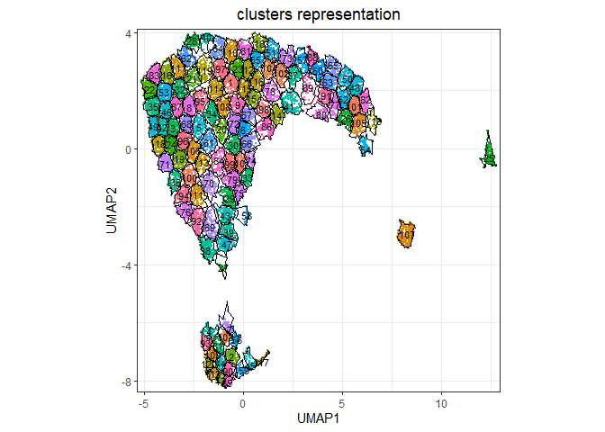
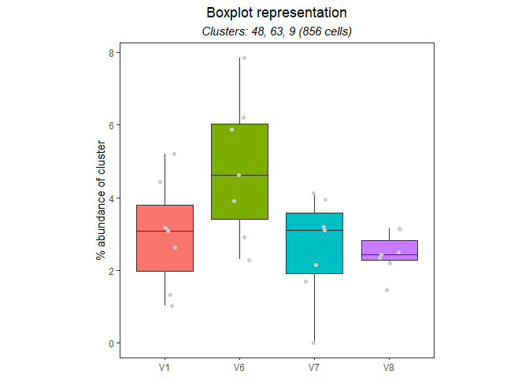
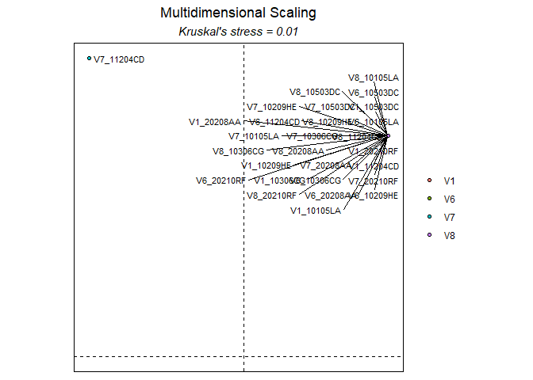
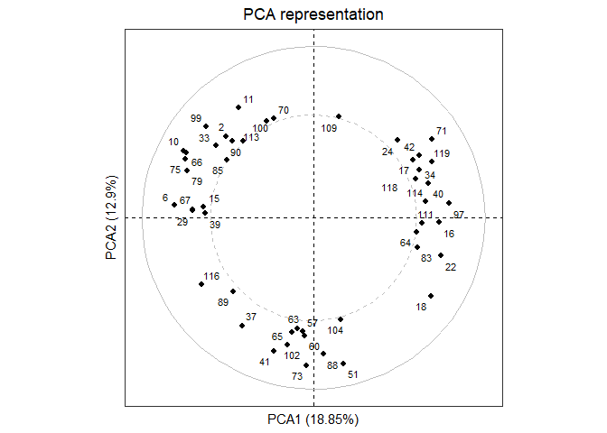

# 1. Introduction

Cytometry data are now classically analyzed using non-linear
dimensionality reduction approaches, but it is still challenging to
easily handle the whole pipeline of computational analyses.

CellVizR allows the statistical analysis and visualization of
high-dimensional cytometry data using manifold algorithms and clustering
methods. Especially, several key analysis steps are available to perform
data importation, manifold generation, cell cluster identification,
statistical analyses, cluster visualization, and quality controls of
generated results.

CellVizR can import cell events from FCS or txt file formats using
different transformation, down-sampling, and normalization approaches.
Manifold representations can be generated using the UMAP, tSNE or
LargeVis algorithms to project cell events into a lower dimensionality
space. Cell clusters can be identified using multiple clustering
algorithms, depending on the user’s assumptions. The characteristics of
cell clusters can be visualized using scatter plots, categorical heatmap
of marker expressions, or using parallel coordinates representations.
Cell clusters having abundances differently expressed between biological
conditions can be identified using several statistical tests.
Statistical results can be visualized using volcano plots or heatmaps.

## 1.1 Workflow overview

In the `CellVizR` workflow, an S4 object is created to store data and
sample information is implemented for analysis. This stored information
will allow performing the statistics and visualization of the dataset.


*Figure 1: Workflow of CellVizR*

*The analysis in CellVizR consists of 5 main steps: (1) importing the
data in FCS or txt format resulting in the creation of an S4 UMAPdata
object; (2) assigning the metadata (sample information) into the
UMAPdata object; and (3) generating the manifold and clustering. The
computed results can be (4) visualized in different manners and (5)
analyzed using statistical approaches.*

## 1.2 Input data

The following conditions must be respected to analyze data with
`CellVizR`:

-   **Type and format of data**: The cytometry data that can be analyzed
    and integrated with `CellVizR` are flow, mass or spectral cytometry
    data. The input files can be in standard cytometry format (FCS) or
    txt format.
-   **Compensation**: Before starting an analysis with `CellVizR`,
    performing the compensation steps for flow cytometry and spectral
    data with conventional software (FlowJo, Kaluza, etc) is necessary.
-   **Cleaning and gating**: It is recommended to remove debris, dead
    cells and doublets before the analysis. A pre-gating on a cell
    population of interest (e.g.lymphocytes, B cells, etc.) can be
    performed.

# 2. Quick start

In this section, the main analysis steps of `CellVizR` are presented.

These steps cover several aspects, such as:

-   Installing the package
-   Importing the data and creating an `UMAPdata` object
-   Creating the manifold and clustering
-   Generating basic visualization

## 2.1 Installation

To download `CellVizR` it is required `devtools`:

``` r
install.packages("devtools")
library("devtools")
install_github("tchitchek-lab/CellVizR")
```

The `CellVizR` package automatically downloads the necessary packages
for its operation such as:
`checkmate`,`cluster`,`concaveman`,`cowplot`,`dbscan`,`dendextend`,`diptest`,`FactoMineR`,`flowCore`,`FNN`,`ggdendro`,`ggiraph`,`ggnewscale`,`ggplot2`,`ggpubr`,`ggrepel`,`ggridges`,`Gmedian`,`gridExtra`,`gtools`,`kohonen`,`MASS`,`plyr`,`reshape`,`reshape2`,`rstatix`,`Rtsne`,`scales`,`spade`,`stats`,`stringr`,`uwot`,`viridis`.
If not, the packages are available on the `CRAN`, except `flowCore`
which is available on `Bioconductor`.

Once installed, `CellVizR` can be loaded using the following command:

``` r
library("CellVizR")
```

## 2.2 Importing cell expression profiles (import)

The `import` function allows importing the expression matrix of the
cytometry files into a `UMAPdata` object.

The files to be loaded must be in FCS or txt format. The `import`
function is used as below:

``` r
# creation of a vector containing the names of the files 
files <- list.files("C:/Users/GWMA/Documents/Transreg/03_Kaluza_exports_renamed/Panel_03_NK/", 
                    pattern = "fcs", full.names = TRUE)

# import the FCS files into a UMAPdata object 
DataCell <- import(files, 
                   filetype = "fcs", 
                   transform = "logicle", 
                   exclude.markers = c("FS-H", "FS-A", "FS-W", "SS-H", 
                                       "SS-A", "SS-W", "Time"), 
                   d.method = "uniform",
                   parameters.method = list("target.percent" = 0.1))
```

The main arguments of the `import` function are:

-   the `filetype` argument, which allows defining the data file type
    (`fcs` or `txt`)
-   the `transform` argument, which allows choosing the type of
    transformation to apply to the data. Possible values are: `none`,
    `logicle`, `arcsinh` and `logarithmic`. It is advised to use a
    `logicle` transform for flow cytometry, and to use an `arcsinh`
    transform for mass cytometry,
-   the `exclude_markers` argument, which is used to remove the
    irrelevant channels
-   the `d.method` argument, which allows choosing the type of
    downsampling to apply to the data. Possible values are: `none`,
    `uniform` and `density`
-   the `parameters.method` argument, which allows choosing the
    parameters for downsampling to apply to the data. Possible values
    are: `target.number`, `target.percent`. If, the downsampling method
    used is `density`, also specify the `exclude.pctile` and
    `target.pctile`,

After importing the dataset, the `plotCellCounts` function allows you to
see the number of cells in each sample to be displayed as follows:

``` r
plotCellCounts(DataCell, 
               stats = c("min","median","mean","q75","max"),
               samples = NULL,
               sort = TRUE)
```


``` r
# Possible to make it interactive
```

## 2.3 Assigning meta-information of biological samples (assignMetadata)

The metadata (information about the biological samples) can be assigned
to each sample in the dataset. These metadata are then used by the
different visualization methods to properly represent biological
conditions, timepoints, and individuals. The metadata argument must be a
dataframe that contains exclusively the following column names:

-   individual: corresponds to the sample identifier,
-   condition: corresponds to the biological condition of the sample,
-   timepoint: corresponds to the timepoint of the sample (optional).

Here is an example of a metadata assignment:

``` r
# creation of the dataframe 
metadata <- data.frame("individual"= rep(c("10105LA","10209HE","10306CG",
                                           "10503DC","11204CD","20208AA",
                                           "20210RF"), 4),
                       "condition"= rep(c("PR","SPA","PSO","B7","SJ","SPA","SPA"),4),
                       "timepoint"= c(rep("V1", 7), rep("V6", 7), rep("V7", 7), rep("V8", 7))
)
```

Important: The rownames column of metadata must match the name of the
samples when imported.

``` r
# assign the dataframe 
DataCell <- assignMetadata(DataCell, 
                           metadata = metadata)
```

## 2.4 Manifold construction and clustering

This section consists in generating the manifold using different
algorithms combined with cell cluster identification.

Two methods are available, depending on the parameters selected:

-   The manifold is generated first, followed by cell cluster
    identification
-   Cell cluster identification is performed followed by the manifold

In the example below, the first method has been performed.

### 2.4.1 Generating a manifold of cell events (generateManifold)

The first step is to compute the manifold on the dataset by following
the instructions below:

``` r
# Perform Manifold from the "UMAPdata" object
DataCell <- generateManifold(DataCell, 
                             markers = c("TCRgd", "NKP44", "HLADR", "NKp30", "NKp46",
                                         "NKG2D", "CD3", "CD16", "CD56", "CD8"), 
                             type = "UMAP", 
                             n_neighbors = 15,
                             n_components = 2,
                             metric = "euclidean",
                             n_epochs = NULL,
                             n_threads = 40, 
                             n_sgd_threads = 1,
                             scale = FALSE)
```

    ## Manifold markers are: TCRgd, NKP44, HLADR, NKp30, NKp46, NKG2D, CD3, CD16, CD56, CD8

    ## Manifold method is: UMAP

    ## 17:12:26 UMAP embedding parameters a = 1.896 b = 0.8006

    ## 17:12:26 Converting dataframe to numerical matrix

    ## 17:12:26 Read 26722 rows and found 10 numeric columns

    ## 17:12:26 Using Annoy for neighbor search, n_neighbors = 15

    ## 17:12:26 Building Annoy index with metric = euclidean, n_trees = 50

    ## 0%   10   20   30   40   50   60   70   80   90   100%

    ## [----|----|----|----|----|----|----|----|----|----|

    ## **************************************************|
    ## 17:12:28 Writing NN index file to temp file C:\Users\GWMA\AppData\Local\Temp\Rtmpea0rjM\file3c5c7a1a12d2
    ## 17:12:28 Searching Annoy index using 40 threads, search_k = 1500
    ## 17:12:29 Annoy recall = 100%
    ## 17:12:29 Commencing smooth kNN distance calibration using 40 threads with target n_neighbors = 15
    ## 17:12:30 Initializing from normalized Laplacian + noise (using irlba)
    ## 17:12:31 Commencing optimization for 200 epochs, with 539456 positive edges using 1 thread
    ## 17:12:49 Optimization finished

The main arguments of the `generateManifold` function are:

-   the `markers` argument, which specifies the markers to be used for
    the manifold generation
-   the `type` argument, which specifies the manifold method to use

### 2.4.2 Identifying cell clusters having similar marker expression (identifyClusters)

The second step is to identify cell clusters by following the
instructions below:

``` r
# Clustering computation from the manifold 
DataCell <- identifyClusters(DataCell, 
                             space = "manifold", 
                             method = "kmeans", 
                             centers = 120, 
                             nstart = 3)
```

    ## Clustering method is: kmeans

    ## Identifying cell clusters...

    ## computing cell clusters boundaries...

    ## computing cell cluster count matrix...

    ## computing cell cluster abundance matrix...

The main arguments of the `identifyClusters` function are:

-   the `space` argument, which determines if the clustering is done on
    the markers or the manifold coordinates
-   the `method` argument, which specifies the clustering algorithm to
    use

After clustering, the `plotClustersCounts` function allows to visualize
the cells of each sample in the clusters as follows:

``` r
plotClustersCounts(DataCell, 
                   clusters = NULL,
                   sort = TRUE)
```


``` r
# Possible to make it interactive
```

## 2.5 Basic Visualization

Once the manifold has been generated and cell clusters have been
identified, it is possible to perform different types of visualization
which are detailed below.

### 2.5.1 Representation of a computed manifold (PlotManifold)

The `plotManifold` function displays a computed manifold representation
for a given analysis. Cell clusters are delimited by black lines on the
manifold.

The main argument of the `plotManifold` function is the `markers`
argument which is used to specify the colour of the cells. If the
`density` value is used, then a UMAP representation showing the
distribution of the cell density for all samples will be shown as below:

``` r
# Display manifold overlay by 'density' 
plotManifold(DataCell, 
             markers = "density",
             samples = NULL)
```


If the name of the marker is used, then the intensity of marker
expression, overlaid on the manifold (e.g. CD8), will be shown as below:

``` r
# Display manifold overlay by 'markers'  
plotManifold(DataCell, 
             markers = "CD8",
             samples = NULL)
```


It is possible to specify the biological samples to be displayed in the
representation using the `samples` argument as below:

``` r
# Display manifold overlay by 'density' by sample 
plotManifold(DataCell, 
             markers = "density",
             samples = "V1_10105LA")
```


If the name of the clusters is used, the the clusters number will be
shown as below:

``` r
# Display manifold overlay by 'cluster' 
plotManifold(DataCell, 
             markers = "clusters")
```



### 2.5.2 Heatmap of cell marker expressions (plotHmExpressions)

The `plotHmExpressions` function shows marker median relative
expressions for all clusters in the whole dataset.

The mean of the median expression of each marker is classified into 4
categories (the number of categories can be changed by users, `nb.cat`
parameters). Hierarchical clustering is performed at both the marker and
cluster levels and is represented using dendrograms (the hierarchical
clustering parameters can be changed by users `method.hclust`
parameters).

This function is used as below:

``` r
# Heatmap of expression markers 
hm.exp <- plotHmExpressions(DataCell)
gridExtra::grid.arrange(hm.exp)
```

 It is
possible to customize the `plotHmExpressions` with these parameters:

-   the `markers` argument, which specifies the markers to be displayed
-   the `clusters` argument, which specifies the identifiers of the
    clusters to be displayed

These parameters can be used independently of each other as in the
following example:

``` r
# Heatmap of expression markers 
hm.exp <- plotHmExpressions(DataCell, 
                            markers = c("NKP44", "NKp30", "NKp46", "NKG2D"), 
                            clusters = c(1:50))
gridExtra::grid.arrange(hm.exp)
```


### 2.5.3 Representation of phenotype of identified cell clusters (plotPhenoClusters)

The `plotMarkerDensity` function shows marker expression densities for
one given cluster.

For each marker distribution, the median expression is represented by a
black dashed line. In addition, the Hartigan’s Dip test p-value, which
indicates whether the distribution is non-unimodal, is indicated by a
green curve or red if it is non-unimodal.

``` r
# PhenoClusters plot for specific cluster 
plotMarkerDensity(DataCell, 
                  clusters = 58)
```

    ## Picking joint bandwidth of 0.0159

    ## Picking joint bandwidth of 0.0294

    ## Picking joint bandwidth of 0.0366

    ## Picking joint bandwidth of 0.0451

    ## Picking joint bandwidth of 0.0378

    ## Picking joint bandwidth of 0.0195

    ## Picking joint bandwidth of 0.0354

    ## Picking joint bandwidth of 0.0254

    ## Picking joint bandwidth of 0.0279

    ## Picking joint bandwidth of 0.0461


### 2.5.4 Representation of phenotype of cell clusters using parallels coordinates (plotCoordinates)

The `plotCoordinates` function shows the phenotype of specific cluster
or a set of combined clusters.

The median marker expression of each sample is represented using
parallel coordinates. The X-axis represents the cellular markers and the
Y-axis represents the marker expressions.

``` r
# Coordinates plot for specific cluster 
plotCoordinates(DataCell, 
                clusters = "58")
```

    ## Using  as id variables


``` r
# Possible to make it interactive
```

# 3. Statistics and visualization

## 3.1 Compute differential abundance analyses

Once the cell clustering performed, it is possible to do a differential
analysis of cell cluster abundances to identify relevant cell clusters.

The `computeStatistics` function allows to perform the such operation
and several parameters must be taken into consideration:

-   the `condition` argument, which specifies the biological condition
    to be compared
-   the `ref.condition` argument, which specifies the reference
    biological condition
-   the `test.statistics` argument, which specifies the name of the
    statistical test to use
-   the `paired` argument, which specifies if samples are paired in the
    statistical comparison

This function is used as follows:

``` r
# Compute statistics 
baseline = "V1"
list.conditions <- c("V6", "V7", "V8")

for (condition in list.conditions) {
  DataCell <- computeStatistics(DataCell, 
                                condition = paste0(condition), 
                                ref.condition = paste0(baseline),
                                test.statistics = "t.test",
                                paired = FALSE)
}
```

    ## Computing of the t.test for: V6 vs. V1

    ## Computing of the t.test for: V7 vs. V1

    ## Computing of the t.test for: V8 vs. V1

## 3.2 Visualisation of statistical analysis

### 3.2.1 Volcano plot of statistical analysis (plotVolcano)

The `plotVolcano` function shows the clusters whose number of associated
cells is statistically different between two biological conditions
and/or timepoints.

For each cluster, the p-value (indicated by -log10(p-value)) is
represented on the Y-axis and the cell abundance fold-change (indicated
by log2(fold-change)) is represented on the X-axis. The thresholds for
the p-value (`th.pv` parameter) and the fold-change (`th.fc` parameter)
are shown as dotted lines. Cell clusters down-represented are shown in
green and cell clusters up-represented are shown in red.

Here is an example for generating such representation:

``` r
# Volcano plot for differential analysis 
plotVolcano(DataCell,
            comparison = ("V7 vs. V1"),
            th.pv = 1.3,
            th.fc = 1.5,
            plot.text = TRUE)
```


``` r
# Possible to make it interactive
```

### 3.2.2 Heatmap of statistical analysis results (plotHmStatistics)

The `plotHmStatistics` function shows the differences in abundance
between different conditions for each cluster.

For each cluster, the p-value, the log2(fold-change) and the effect size
(`statistics` parameters) can be represented. Down-represented clusters
are represented in orange, and up-represented clusters are represented
in blue. Furthermore, it is possible to choose the clusters to be
represented with the `clusters` parameter.

Here is an example for generating such representation:

``` r
# Heatmap of statistics
hm.stats <- plotHmStatistics(DataCell, 
                             clusters = NULL,
                             statistics = "pvalue")

gridExtra::grid.arrange(hm.stats)
```


## 3.3 Visualisation of cell cluster abundances

### 3.3.1 Heatmap of cell cluster abundances (plotHmAbundances)

The `plotHmAbundances` function shows the cellular distribution of
samples within a given cluster.

The more the sample is represented within the cluster, the redder the
tile. If the sample is not represented in the cluster, then the tile
will be black. The `plotHmAbundances` function can be interesting to
visualize the abundance of statistically different clusters between two
conditions, as in the following example:

``` r
#Samples to study
samples = getSamples(DataCell, 
                     timepoint = c("V1", "V6"))

#Statistically different clusters
stats <- DataCell@statistic[DataCell@statistic$comparison == "V6 vs. V1",]
clusters = stats[stats$pvalue<=0.05 & abs(stats$lfc)>log(1.2)/log(2),]$clusters

# Heatmap of abundances
hm.abun <- plotHmAbundances(DataCell, 
                            clusters = clusters,
                            samples = samples,
                            rescale = TRUE)

gridExtra::grid.arrange(hm.abun)
```


### 3.3.2 Cell cluster abundances using a boxplot representation (plotBoxplot)

The `plotBoxPlot` function shows the cell distribution between several
biological conditions and/or timepoints for a single cluster or for a
combined set of clusters.

This display shows the abundances of the user-defined cell clusters
(`clusters` parameter). It is possible to observe the cell abundance as
a function of the biological condition or timepoint (`obervation`
parameter). In addition, statistical tests can be performed and
displayed directly on the boxplot.

Here is an example for generating such representation:

``` r
# Boxplot for differential analysis
plotBoxplot(DataCell, 
            clusters = clusters,
            samples = NULL,
            observation = "timepoint", 
            test.statistics = "t.test")
```



``` r
# Possible to make it interactive
```

Other possible parameters to customize the `plotBoxPlot` are:

-   the `samples` argument, which specifies the biological samples to be
    displayed
-   the `paired` argument, which specifies if samples are paired in the
    statistical comparison

### 3.3.3 MDS representation based on cell cluster abundances (plotMDS)

The `plotMDS` function shows similarities between samples or clusters
based on cell cluster abundances.

Each point represents a sample or a cluster (`levels` parameter) and the
distance between the points is proportional to the Euclidean distance
between these objects. It is possible to observe the cell abundance as a
function of the biological condition or timepoint (`condition.samples`
parameter)

Here is an example for generating such representation:

``` r
# MDS
plotMDS(DataCell, 
        levels = "samples", 
        condition.samples = "timepoint", 
        clusters = NULL, 
        samples = NULL,
        plot.text = TRUE)
```



``` r
# Possible to make it interactive
```

Other possible parameters to customize the `plotMDS` are:

-   the `clusters` argument, which specifies the identifiers of the
    clusters to be displayed
-   the `samples` argument, which specifies the biological samples to be
    displayed

### 3.3.4 PCA representation based on cell cluster abundances (plotPCA)

The `plotPCA` function shows similarities between samples or clusters
based on cell cluster abundances.

Each point represents a sample or a cluster (`levels` parameter). It is
possible to observe the cell abundance as a function of the biological
condition or timepoint (`condition.samples` parameter)

``` r
# PCA
plotPCA(DataCell, 
        levels = "clusters", 
        clusters = NULL, 
        samples = NULL, 
        condition.samples = "condition",
        plot.text = TRUE)
```



``` r
# Possible to make it interactive
```

Other possible parameters to customize the `plotPCA` are:

-   the `clusters` argument, which specifies the identifiers of the
    clusters to be displayed
-   the `samples` argument, which specifies the biological samples to be
    displayed

# 4. Quality control

The `CellVizR` package allows to perform quality control of generated
results.

The quality control can be performed:

-   on the input dataset to check the names and range expression of the
    markers of each sample
-   on the generated results, to check the quality of the cell
    clustering.

## 4.1 Quality control of the dataset

The input dataset can be checked in two ways. The first method checks
the concordance of the markers names between the different samples.

Here is an example of generating such quality control:

``` r
# Check for marker concordance
QCN <- QCMarkerNames(files)
```

    ##            nb_cells FS-H FS-A FS-W SS-H SS-A SS-W       FL1-A    FL2-A  FL3-A
    ## V1_10105LA     5768 FS-H FS-A FS-W SS-H SS-A SS-W TCR gd-FITC NKP44-PE DR-ECD
    ## V1_10209HE     4944 FS-H FS-A FS-W SS-H SS-A SS-W TCR gd-FITC NKP44-PE DR-ECD
    ## V1_10306CG     4746 FS-H FS-A FS-W SS-H SS-A SS-W TCR gd-FITC NKP44-PE DR-ECD
    ## V1_10503DC     5877 FS-H FS-A FS-W SS-H SS-A SS-W TCR gd-FITC NKP44-PE DR-ECD
    ## V1_11204CD     5194 FS-H FS-A FS-W SS-H SS-A SS-W TCR gd-FITC NKP44-PE DR-ECD
    ## V1_20208AA     9435 FS-H FS-A FS-W SS-H SS-A SS-W TCR gd-FITC NKP44-PE DR-ECD
    ##                 FL4-A      FL5-A     FL6-A    FL7-A     FL8-A      FL9-A FL10-A
    ## V1_10105LA NKp30-Pcy5 NKp46-Pcy7 NKG2D-APC CD3-A700 CD16-A750 CD56-BV421 CD8-KO
    ## V1_10209HE NKp30-Pcy5 NKp46-Pcy7 NKG2D-APC CD3-A700 CD16-A750 CD56-BV421 CD8-KO
    ## V1_10306CG NKp30-Pcy5 NKp46-Pcy7 NKG2D-APC CD3-A700 CD16-A750 CD56-BV421 CD8-KO
    ## V1_10503DC NKp30-Pcy5 NKp46-Pcy7 NKG2D-APC CD3-A700 CD16-A750 CD56-BV421 CD8-KO
    ## V1_11204CD NKp30-Pcy5 NKp46-Pcy7 NKG2D-APC CD3-A700 CD16-A750 CD56-BV421 CD8-KO
    ## V1_20208AA NKp30-Pcy5 NKp46-Pcy7 NKG2D-APC CD3-A700 CD16-A750 CD56-BV421 CD8-KO

If the marker names are not the same for each sample, they can be
corrected using the `renameMarkers` as below:

``` r
# Rename markers if necessary
DataCell <- renameMarkers(DataCell, marker.names = c("TCRgd", "NKP44", "HLADR", "NKp30", "NKp46",
                                                     "NKG2D", "CD3", "CD16", "CD56", "CD8"))
```

The second method computes the 5 centiles and 95 centiles expression
values for each marker of each sample:

``` r
# Check the expression values for markers
QCR <- QCMarkerRanges(files)
```

    ##                  FS       FS        FS       SS       SS        SS TCR gd-FITC
    ## V1_10105LA 3.835954 4.591215 0.8492808 3.243660 4.012122 0.8449608   0.9154929
    ## V1_10209HE 3.829768 4.557351 0.8449608 3.230622 3.977681 0.8362701   1.0896257
    ## V1_10306CG 3.947060 4.677327 0.8449608 3.303869 4.055231 0.8406239   1.0983334
    ## V1_10503DC 3.828357 4.564343 0.8492808 3.287315 4.047948 0.8449608   1.1105192
    ## V1_11204CD 3.725456 4.474459 0.8449608 3.215499 3.984430 0.8362701   0.9982873
    ## V1_20208AA 3.812238 4.545145 0.8492808 3.232515 3.996216 0.8406239   1.1983233
    ##             NKP44-PE    DR-ECD  NKp30-Pcy5 NKp46-Pcy7 NKG2D-APC    CD3-A700
    ## V1_10105LA 1.0221593 0.9982851  0.34437769   1.912841  2.186237  1.82498352
    ## V1_10209HE 0.4540053 1.2876305  0.41447530   1.680014  2.092440 -0.25736492
    ## V1_10306CG 0.3002701 1.4209953  0.02057747   2.385978  2.955476  0.36994782
    ## V1_10503DC 0.6950154 1.0563525  0.19227490   2.129246  2.526725 -0.57064192
    ## V1_11204CD 1.0852063 1.3009333  1.03100626   1.903930  1.851252 -0.31361279
    ## V1_20208AA 1.1473595 1.5286735 -0.03055137   1.761246  2.481763 -0.03495686
    ##            CD16-A750 CD56-BV421   CD8-KO
    ## V1_10105LA  1.981205   2.287023 1.398245
    ## V1_10209HE  2.317233   2.562494 1.469428
    ## V1_10306CG  2.504834   2.555830 1.471242
    ## V1_10503DC  2.309174   2.503308 1.793365
    ## V1_11204CD  2.072469   2.448918 1.915688
    ## V1_20208AA  2.505797   2.561197 1.540455

    ##                  FS       FS        FS       SS       SS        SS TCR gd-FITC
    ## V1_10105LA 4.157933 4.908130 0.9200630 3.619960 4.415486 0.9745206    1.894825
    ## V1_10209HE 4.173238 4.909950 0.8873849 3.582930 4.326441 0.8956605    1.750218
    ## V1_10306CG 4.248189 4.976780 0.8790391 3.613209 4.356738 0.8956605    1.733319
    ## V1_10503DC 4.137537 4.878283 0.8956605 3.625537 4.391105 0.9119997    1.838933
    ## V1_11204CD 4.168662 4.901672 0.8997718 3.600143 4.383557 0.9320248    2.104529
    ## V1_20208AA 4.155026 4.892967 0.8873849 3.566284 4.348759 0.9200630    1.872118
    ##            NKP44-PE   DR-ECD NKp30-Pcy5 NKp46-Pcy7 NKG2D-APC CD3-A700 CD16-A750
    ## V1_10105LA 2.353069 3.359568   2.728439   3.776323  3.607855 2.839736  4.350019
    ## V1_10209HE 2.096698 3.514636   2.721771   3.565452  3.520383 2.540947  4.428824
    ## V1_10306CG 2.086451 3.443916   2.818599   3.644543  3.668300 2.725701  4.420814
    ## V1_10503DC 2.078534 2.726523   2.796699   3.537180  3.538998 2.533955  4.354336
    ## V1_11204CD 2.277626 2.875062   2.744615   3.588735  3.476107 2.528107  4.214141
    ## V1_20208AA 2.236382 3.243167   2.740408   3.509518  3.544084 2.644464  4.447594
    ##            CD56-BV421   CD8-KO
    ## V1_10105LA   3.960701 2.987863
    ## V1_10209HE   4.030643 3.127233
    ## V1_10306CG   3.938093 3.354593
    ## V1_10503DC   3.866357 3.505325
    ## V1_11204CD   3.871029 3.441518
    ## V1_20208AA   3.866826 3.284242

## 4.2 Control quality of the cell clustering result

The quality control of clustering can be checked in two ways.

The first method allows the identification of small clusters,
i.e.clusters whose number of cells is below a specific threshold. The
results can be represented as a heatmap. On the left are the
contributions of each sample and on the right are the contribution of
the whole dataset. If the tile is red then the cluster is less than the
specified number of cells, if the tile is green, the cluster is greater
than or equal to the specified number of cells. The percentage of
clusters with a small number of cells among all clusters is shown at the
top of the heatmap.

The function is as below:

``` r
# QC for small clusters 
QCS <- QCSmallClusters(DataCell,
                       th.size = 50, 
                       plot.device = TRUE)
```


    ##      V1_10105LA V1_10209HE V1_10306CG V1_10503DC V1_11204CD V1_20208AA
    ## [1,]       TRUE       TRUE       TRUE      FALSE      FALSE       TRUE
    ## [2,]      FALSE      FALSE       TRUE      FALSE      FALSE      FALSE
    ## [3,]       TRUE       TRUE       TRUE       TRUE       TRUE       TRUE
    ## [4,]      FALSE       TRUE       TRUE       TRUE       TRUE      FALSE
    ## [5,]       TRUE       TRUE       TRUE       TRUE       TRUE       TRUE
    ## [6,]       TRUE       TRUE       TRUE      FALSE      FALSE      FALSE
    ##      V1_20210RF V6_10105LA V6_10209HE V6_10306CG V6_10503DC V6_11204CD
    ## [1,]      FALSE       TRUE       TRUE       TRUE       TRUE       TRUE
    ## [2,]      FALSE      FALSE      FALSE      FALSE      FALSE      FALSE
    ## [3,]      FALSE      FALSE       TRUE       TRUE      FALSE      FALSE
    ## [4,]      FALSE      FALSE       TRUE       TRUE      FALSE       TRUE
    ## [5,]       TRUE       TRUE      FALSE      FALSE       TRUE      FALSE
    ## [6,]       TRUE       TRUE       TRUE      FALSE      FALSE      FALSE
    ##      V6_20208AA V6_20210RF V7_10105LA V7_10209HE V7_10306CG V7_10503DC
    ## [1,]       TRUE      FALSE       TRUE       TRUE       TRUE      FALSE
    ## [2,]      FALSE      FALSE      FALSE      FALSE      FALSE      FALSE
    ## [3,]      FALSE      FALSE      FALSE       TRUE       TRUE      FALSE
    ## [4,]      FALSE      FALSE      FALSE       TRUE       TRUE       TRUE
    ## [5,]      FALSE      FALSE      FALSE      FALSE      FALSE       TRUE
    ## [6,]      FALSE      FALSE       TRUE       TRUE       TRUE      FALSE
    ##      V7_11204CD V7_20208AA V7_20210RF V8_10105LA V8_10209HE V8_10306CG
    ## [1,]       TRUE      FALSE      FALSE       TRUE       TRUE       TRUE
    ## [2,]      FALSE      FALSE      FALSE       TRUE      FALSE      FALSE
    ## [3,]       TRUE      FALSE      FALSE       TRUE       TRUE       TRUE
    ## [4,]       TRUE       TRUE      FALSE       TRUE       TRUE      FALSE
    ## [5,]       TRUE       TRUE      FALSE      FALSE      FALSE       TRUE
    ## [6,]       TRUE      FALSE      FALSE       TRUE       TRUE      FALSE
    ##      V8_10503DC V8_11204CD V8_20208AA V8_20210RF total.cells
    ## [1,]      FALSE      FALSE       TRUE      FALSE       FALSE
    ## [2,]      FALSE      FALSE      FALSE      FALSE       FALSE
    ## [3,]      FALSE      FALSE       TRUE      FALSE       FALSE
    ## [4,]       TRUE       TRUE      FALSE      FALSE       FALSE
    ## [5,]       TRUE       TRUE       TRUE       TRUE       FALSE
    ## [6,]      FALSE      FALSE      FALSE      FALSE       FALSE

The second method allows to identify the uniform clusters, i.e.those
with unimodal expression and low dispersion of expression for all its
markers.

The most important parameter of the `QCUniformClusters` function is
`uniform.test`, three possibilities:

-   `uniform` corresponds to the verification of the unimodal
    distribution of markers with Hartigan’s test (`th.pvalue`
    parameter),
-   `IQR` corresponds to the verification of the distribution of markers
    so that they are not below the IQR threshold (`th.IQR` parameter)
-   `both` correspond to the combination of the two parameters: uniform
    and IQR

The results can be represented as a heatmap. If the tile is green then
the cell clusters have the uniform phenotype, if the tile is red, the
cell clusters have the phenotype that is not uniform. The percentage of
clusters having a uniform phenotype among all clusters is shown at the
top of the heatmap. If the score is high, it indicates that the
clustering is good.

The function is as below:

``` r
# QC for uniform clusters
QCU <- QCUniformClusters(DataCell,
                         uniform.test = "both",
                         th.pvalue = 0.05,
                         th.IQR = 2,
                         plot.device = TRUE)
```


    ##   clusters markers    pv_dip       IQR passed
    ## 1        1    CD16 0.9969386 0.2651895   TRUE
    ## 2        1     CD3 0.9948315 0.3032393   TRUE
    ## 3        1    CD56 0.9920345 0.3288604   TRUE
    ## 4        1     CD8 0.9717085 0.1813187   TRUE
    ## 5        1   HLADR 0.4625909 0.2673890   TRUE
    ## 6        1   NKG2D 0.9863257 0.2057160   TRUE

# 5.Advanced graphical representation

## 5.1 Modification of generated plot

Modification titre or axes \## 5.2 Combined graphical representation
Grid arrange + HM \## 5.3 Interactive graphics ggiraph

# 6. Advanced usage

## 6.1 Get samples

The `getSamples()` function allows xxx

The procedure is as follows:

``` r
samples <- getSamples()
```

## 6.2 Upsampling

The `performUpsampling` function allows the data set to be implemented
if downsampling has been performed.

This function is used after performing the manifold and clustering (Step
2.4). After calculating the centroids from the existing clusters, the
implemented cells will be associated according to their expression
similarity with the centroid.

The procedure is as follows:

``` r
DataCell <- performUpsampling(DataCell,
                              files = files,
                              transform = "logicle")
```

## 6.3 Metadata

The `createMetaclusters()` function allows clusters to be combined to
create a metaclusters.

This function should be used as many times as there are metaclusters to
be created. Be careful, when metaclusters are created, the origianl
clusters are lost.

The procedure is as follows:

``` r
DataCell <- CreateMetaclusters(DataCell, 
                               clusters = xx, 
                               metaclusters = xx)
```

## 6.4 Export

The `export` function allows extracting of the dataset in FCS or txt
format with some parameters such as UMAP coordinates and clusters.

Please note that if downsampling and upsampling have been performed,
only the downsampled cells will be extracted.

With the following method:

``` r
export(DataCell,
       filename = "Analyses_NK_K100.fcs",
       clusters = NULL,
       samples = NULL)
```

    ## [1] "Analyses_NK_K100.fcs"
