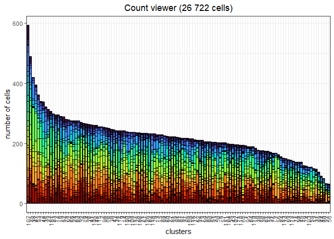
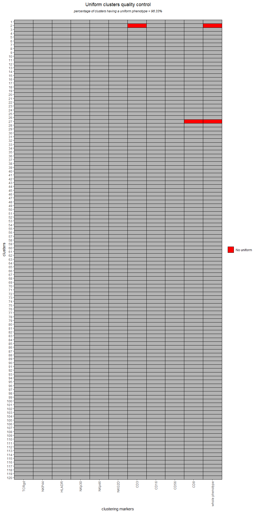
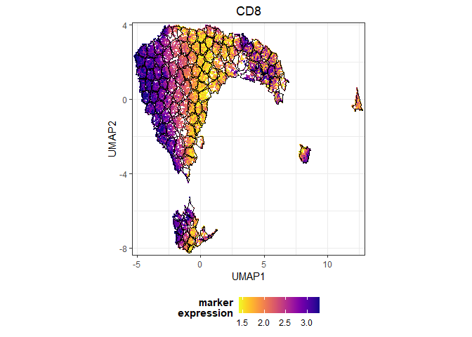
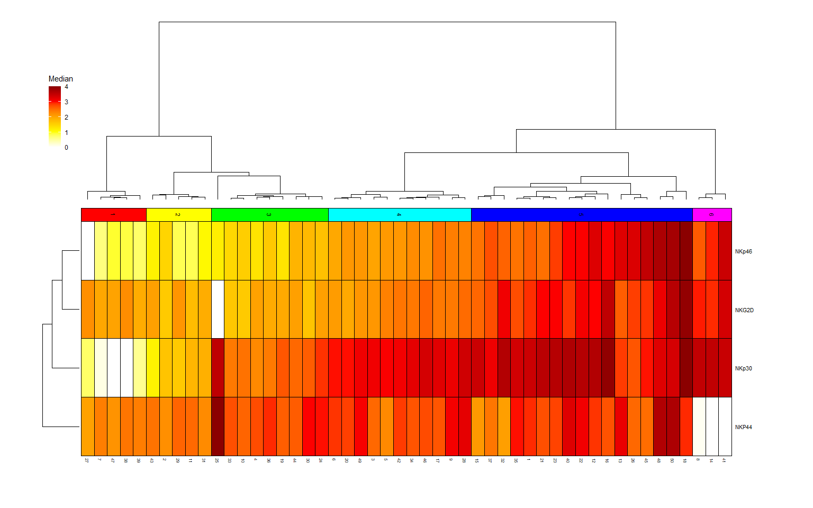
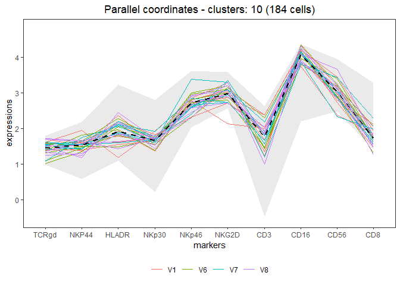
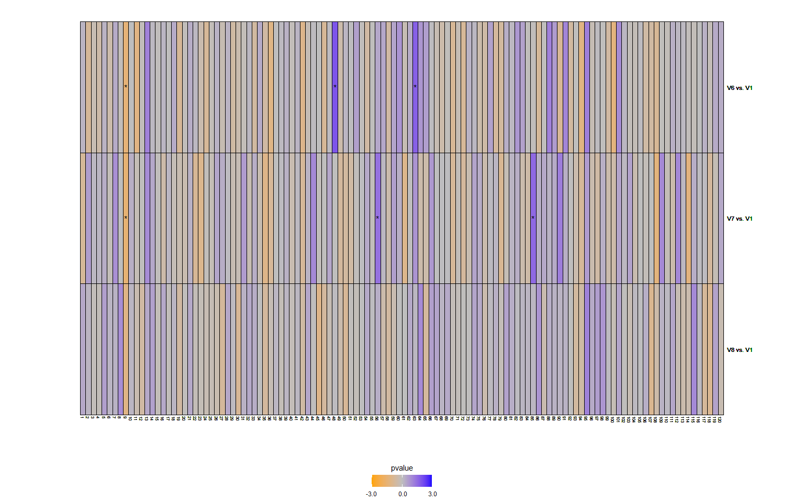
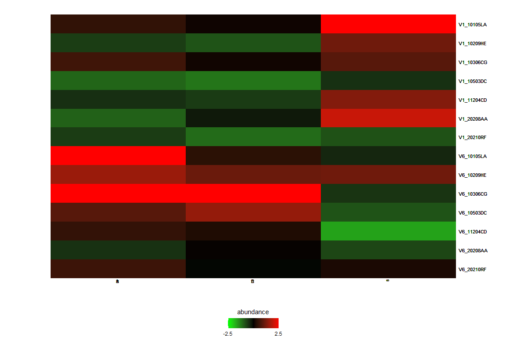
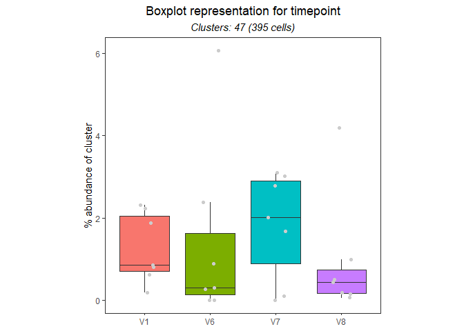
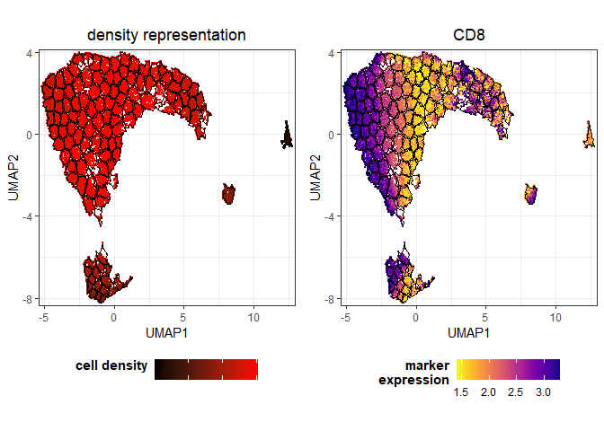

# 1.Introduction

Single-cell data, obtained either from high-dimensional cytometry and
single-cell transcriptomics, are now classically analyzed using
non-linear dimensionality reduction approaches, but it is still
challenging to easily handle the whole pipeline of computational
analyses.

CellVizR allows the statistical analysis and visualization of
single-cell data using manifold algorithms and clustering methods.
Especially, several key analysis steps are available to perform (i) data
importation; (ii) manifold generation and visualization; (iii) cell
cluster identification; (iv) characterization of cell clusters; (v)
statistical analysis of cell cluster abundances; (vi) multivariate
analysis using both unsupervised and supervised algorithms; (vii)
quality controls of input files and generated results.

CellVizR can import cell events from FCS, MTX, or txt file formats using
different transformation, down-sampling, and normalization approaches.
Manifold representations can be generated using the UMAP, t-SNE or
LargeVis algorithms to project cell events into a 2-dimensional
dimensionality space. Cell clusters can be identified using multiple
clustering algorithms, depending on the user’s assumptions. The
characteristics of cell clusters can be visualized using scatter plots,
categorical heatmap of marker expressions, or using parallel coordinates
representations. Cell clusters having abundances differently expressed
between biological conditions can be identified using several
statistical tests. Statistical results can be visualized using volcano
plots or heatmaps.

## 1.1 Workflow overview

In the `CellVizR` workflow, an S4 object is created to store data,
sample information as well as the different performed analyses. This
stored information will allow performing the statistics and
visualization of the dataset.


*Figure 1: Workflow of CellVizR*

*The analysis in CellVizR consists of 5 main steps: (1) importing the
data in FCS, MTX, or txt format resulting in the creation of an S4
Celldata object; (2) assigning the metadata (sample information) into
the Celldata object; and (3) generating the manifold and clustering. The
computed results can be (4) visualized in different manners and (5)
analyzed using statistical approaches.*

## 1.2 Input data

High-dimensional cytometry data can be analyzed by `CellVizR`:

-   **Type and format of data**: The cytometry data that can be analyzed
    and integrated with `CellVizR` are flow, mass or spectral cytometry
    data. The input files can be in standard cytometry format (FCS) or
    in txt format.
-   **Compensation**: Before starting an analysis with `CellVizR`,
    performing the compensation steps for flow cytometry and spectral
    data with conventional software (such as FlowJo, Kaluza, etc) is
    mandatory.
-   **Cleaning and gating**: It is highly recommended to remove debris,
    dead cells and doublets before the analysis. A pre-gating on a cell
    population of interest (e.g.lymphocytes, B cells, etc.) can also be
    performed, which will help to drastically reduce the computation
    time.

Single-cell transcriptomics data can also be analyzed by `CellVizR`:

-   **Type and format of data**: Single-cell RNA sequencing (scRNA-Seq)
    can also be analyzed and integrated with `CellVizR`. The input files
    can be in standard MTX file format.
-   **Cleaning**: Before starting an analysis with `CellVizR`,
    performing the preprocesing steps for cell count quantification and
    spectral data with conventional software (CellRanger) is mandatory.

# 2. Quick start

In this section, the main analysis steps of `CellVizR` are presented.

These steps cover several aspects, such as:

-   Installing the package
-   Importing the data and creating an `Celldata` object
-   Creating the manifold and clustering
-   Generating analyses and visualizations

## 2.1 Installation

To download `CellVizR` it is required `devtools`:

``` r
install.packages("devtools")
library("devtools")
install_github("tchitchek-lab/CellVizR")
```

The `CellVizR` package automatically downloads the necessary packages
for its operation such as:
`checkmate`,`cluster`,`concaveman`,`cowplot`,`dbscan`,`dendextend`,`diptest`,`FactoMineR`,`flowCore`,`FNN`,`ggdendro`,`ggiraph`,`ggnewscale`,`ggplot2`,`ggpubr`,`ggrepel`,`ggridges`,`Gmedian`,`gridExtra`,`gtools`,`kohonen`,`MASS`,`plyr`,`reshape`,`reshape2`,`rstatix`,`Rtsne`,`scales`,`seurat`,`stats`,`stringr`,`uwot`,`viridis`.
If not, the packages are available on the `CRAN`, except `flowCore`
which is available on `Bioconductor`.

Once installed, `CellVizR` can be loaded using the following command:

``` r
library("CellVizR")
```

## 2.2 Importing cell expression profiles

The `import()` function allows importing the expression matrix of the
cytometry files into a `Celldata` object.

The files to be loaded must be in FCS or txt format. The `import()`
function is used as below:

``` r
files <- list.files(NK_files, 
                    pattern = "fcs", full.names = TRUE) # Replace NK_files with your own path to FCS files

# import the FCS files into a Celldata object 
DataCell <- import(files, 
                   filetype = "fcs", 
                   transform = "logicle", 
                   exclude.markers = c("FS-H", "FS-A", "FS-W", "SS-H", 
                                       "SS-A", "SS-W", "Time"), 
                   d.method = "uniform",
                   parameters.method = list("target.percent" = 0.1))
```

The main arguments of the `import()` function are:

-   the `filetype` argument, which allows defining the data file type
    (`fcs` or `txt`)
-   the `transform` argument, which allows choosing the type of
    transformation to apply to the data. Possible values are: `none`,
    `logicle`, `arcsinh` and `logarithmic`. It is advised to use a
    `logicle` transform for flow cytometry, and to use an `arcsinh`
    transform for mass cytometry,
-   the `exclude_markers` argument, which is used to remove the
    irrelevant channels
-   the `d.method` argument, which allows choosing the type of
    downsampling to apply to the data. Possible values are: `none` or
    `uniform`. With `d.method` set to `uniform`, each cell has the same
    probability to be selected.
-   the `parameters.method` argument, which allows choosing the
    parameters for downsampling to apply to the data. Possible values
    are: `target.number`, `target.percent`.

Of note, single-cell transcriptomics data can be imported using the
`importMT()` function.

To correctly write down the markers to exlcude (if any), we invite users
to run the following commands to list the marker names which are present
in the loaded dataset:

``` r
# Retrieving of the marker names
QCN <- QCMarkerNames(files)
colnames(QCN)[-1]
```

    ##  [1] "FS-H"   "FS-A"   "FS-W"   "SS-H"   "SS-A"   "SS-W"   "FL1-A"  "FL2-A" 
    ##  [9] "FL3-A"  "FL4-A"  "FL5-A"  "FL6-A"  "FL7-A"  "FL8-A"  "FL9-A"  "FL10-A"

Once the `DataCell` object is created, users can print a lot of useful
information about it with:

``` r
print(DataCell)
```

    ## Object class: Celldata
    ## Numbers of samples: 28
    ## - Samples: V1_10105LA, V1_10209HE, V1_10306CG, V1_10503DC, V1_11204CD, V1_20208AA, V1_20210RF, V6_10105LA, V6_10209HE, V6_10306CG ...
    ## Numbers of markers: 9
    ## - Markers: TCR gd-FITC, NKP44-PE, DR-ECD, NKp30-Pcy5, NKp46-Pcy7, NKG2D-APC, CD3-A700, CD16-A750, CD56-BV421, CD8-KO
    ## Numbers of cells: 26,722
    ## - Metadata: 
    ## - Manifold
    ## No manifold
    ## - Clustering
    ## No clustering

## 2.3 Quality control of the dataset

The `CellVizR` package allows to perform quality control of the imported
dataset, notably to check the names and range expression of the markers
of each sample.

The input dataset can be checked in two ways.

The first method checks the concordance of the markers names between the
different samples.

Here is an example of generating such quality control:

``` r
# Check for marker concordance
QCN <- QCMarkerNames(files)
```

    ##            nb_cells FS-H FS-A FS-W SS-H SS-A SS-W       FL1-A    FL2-A  FL3-A
    ## V1_10105LA     5768 FS-H FS-A FS-W SS-H SS-A SS-W TCR gd-FITC NKP44-PE DR-ECD
    ## V1_10209HE     4944 FS-H FS-A FS-W SS-H SS-A SS-W TCR gd-FITC NKP44-PE DR-ECD
    ## V1_10306CG     4746 FS-H FS-A FS-W SS-H SS-A SS-W TCR gd-FITC NKP44-PE DR-ECD
    ## V1_10503DC     5877 FS-H FS-A FS-W SS-H SS-A SS-W TCR gd-FITC NKP44-PE DR-ECD
    ## V1_11204CD     5194 FS-H FS-A FS-W SS-H SS-A SS-W TCR gd-FITC NKP44-PE DR-ECD
    ## V1_20208AA     9435 FS-H FS-A FS-W SS-H SS-A SS-W TCR gd-FITC NKP44-PE DR-ECD
    ##                 FL4-A      FL5-A     FL6-A    FL7-A     FL8-A      FL9-A FL10-A
    ## V1_10105LA NKp30-Pcy5 NKp46-Pcy7 NKG2D-APC CD3-A700 CD16-A750 CD56-BV421 CD8-KO
    ## V1_10209HE NKp30-Pcy5 NKp46-Pcy7 NKG2D-APC CD3-A700 CD16-A750 CD56-BV421 CD8-KO
    ## V1_10306CG NKp30-Pcy5 NKp46-Pcy7 NKG2D-APC CD3-A700 CD16-A750 CD56-BV421 CD8-KO
    ## V1_10503DC NKp30-Pcy5 NKp46-Pcy7 NKG2D-APC CD3-A700 CD16-A750 CD56-BV421 CD8-KO
    ## V1_11204CD NKp30-Pcy5 NKp46-Pcy7 NKG2D-APC CD3-A700 CD16-A750 CD56-BV421 CD8-KO
    ## V1_20208AA NKp30-Pcy5 NKp46-Pcy7 NKG2D-APC CD3-A700 CD16-A750 CD56-BV421 CD8-KO

If the marker names are not the same for each sample, they can be
corrected using the `renameMarkers` as below:

``` r
# Rename markers if necessary
DataCell <- renameMarkers(DataCell, marker.names = c("TCRgd", "NKP44", "HLADR", "NKp30", "NKp46",
                                                     "NKG2D", "CD3", "CD16", "CD56", "CD8"))
```

The second method computes the median, the 5th percentile and the 95th
percentile expression values for each marker of each sample:

``` r
# Check the expression values for markers
QCR <- QCMarkerRanges(files)
```

These data then can be displayed in order to evaluate if some markers
and/or samples deviate strongly from the most frequent observations:


Please note that at any moment, users can decide to generate interactive
versions of the plots generated throughout this workflow. They just need
to save the plot in a variable then call `girafe` function like in the
following commands:

``` r
plot = QCMarkerRanges(files)

plot <- ggiraph::girafe(ggobj = plot,
                          options = list(ggiraph::opts_sizing(width = .9),
                                         ggiraph::opts_hover_inv(css = "opacity:0.6;"),
                                         ggiraph::opts_hover(css = "fill:black;")))
  
plot
```

## 2.4 Assigning meta-information of biological samples

The metadata (information about the biological samples) can be assigned
to each sample in the dataset. These metadata are then used by the
different visualization methods to properly represent biological
conditions, timepoints, and individuals. The metadata argument must be a
dataframe that contains exclusively the following column names:

-   `individual`: corresponds to the sample identifier,
-   `condition`: corresponds to the biological condition of the sample,
-   `timepoint`: corresponds to the timepoint of the sample (optional).

Here is an example of a metadata assignment:

``` r
# creation of the dataframe 
metadata <- data.frame("individual"= rep(c("10105LA","10209HE","10306CG",
                                           "10503DC","11204CD","20208AA",
                                           "20210RF"), 4),
                       "condition"= rep(c("PR","SPA","PSO","B7","SJ","SPA","SPA"),4),
                       "timepoint"= c(rep("V1", 7), rep("V6", 7), rep("V7", 7), rep("V8", 7))
)
```

Important: The rownames column of metadata must match the name of the
samples when imported.

``` r
rownames(metadata) = gsub("(\\.fcs)", "", list.files(NK_files, 
                                pattern = "fcs",
                                full.names = FALSE)) # Replace NK_files with your own path to FCS files
```

``` r
# assign the dataframe 
DataCell <- assignMetadata(DataCell, 
                           metadata = metadata)
```

## 2.5 Visualization to the number of cells associated to samples

After importing the dataset, the `plotCellCounts()` function allows you
to see the number of cells in each sample to be displayed as follows:

``` r
plotCellCounts(DataCell, 
               stats = c("min","median","mean","q75","max"),
               samples = NULL,
               sort = TRUE)
```


## 2.6 Manifold construction and clustering

This section consists in generating the manifold using different
algorithms combined with cell cluster identification.

Two methods are available, depending on the parameters selected:

-   The manifold is generated first, followed by cell cluster
    identification
-   Cell cluster identification is performed followed by the manifold

In the example below, the first method has been performed.

### 2.6.1 Generating a manifold of cell events

The first step is to compute the manifold on the dataset by following
the instructions below:

``` r
# Perform Manifold from the "Celldata" object
DataCell <- generateManifold(DataCell, 
                             markers = c("TCRgd", "NKP44", "HLADR", "NKp30", "NKp46",
                                         "NKG2D", "CD3", "CD16", "CD56", "CD8"), 
                             method = "UMAP", 
                             n_neighbors = 15,
                             n_components = 2,
                             metric = "euclidean",
                             n_epochs = NULL,
                             n_threads = 1, 
                             n_sgd_threads = 1,
                             scale = FALSE)
```

    ## Manifold markers are: TCRgd, NKP44, HLADR, NKp30, NKp46, NKG2D, CD3, CD16, CD56, CD8

    ## Manifold method is: UMAP

    ## 

    ## 11:47:09 UMAP embedding parameters a = 1.896 b = 0.8006

    ## 11:47:09 Converting dataframe to numerical matrix

    ## 11:47:09 Read 26722 rows and found 10 numeric columns

    ## 11:47:09 Using Annoy for neighbor search, n_neighbors = 15

    ## 11:47:10 Building Annoy index with metric = euclidean, n_trees = 50

    ## 0%   10   20   30   40   50   60   70   80   90   100%

    ## [----|----|----|----|----|----|----|----|----|----|

    ## **************************************************|
    ## 11:47:11 Writing NN index file to temp file C:\Users\PRE.LAB\AppData\Local\Temp\RtmpqwPHBh\file17104dc34f43
    ## 11:47:11 Searching Annoy index using 1 thread, search_k = 1500
    ## 11:47:16 Annoy recall = 100%
    ## 11:47:16 Commencing smooth kNN distance calibration using 1 thread with target n_neighbors = 15
    ## 11:47:17 Initializing from normalized Laplacian + noise (using irlba)
    ## 11:47:17 Commencing optimization for 200 epochs, with 539456 positive edges using 1 thread
    ## 11:47:33 Optimization finished

The main arguments of the `generateManifold()` function are:

-   the `markers` argument, which specifies the markers to be used for
    the manifold generation
-   the `method` argument, which specifies the manifold method to use

### 2.6.2 Identifying cell clusters having similar marker expression

The second step is to identify cell clusters by following the
instructions below:

``` r
# Clustering computation from the manifold 
DataCell <- identifyClusters(DataCell, 
                             space = "manifold", 
                             method = "kmeans", 
                             centers = 120, 
                             nstart = 3)
```

    ## Clustering method is: kmeans

    ## 

    ## Identifying cell clusters...

    ## computing cell clusters boundaries...

    ## computing cell cluster count matrix...

    ## computing cell cluster abundance matrix...

The main arguments of the `identifyClusters()` function are:

-   the `space` argument, which determines if the clustering is done on
    the markers or the manifold coordinates
-   the `method` argument, which specifies the clustering algorithm to
    use

After clustering, the `plotClustersCounts()` function allows to
visualize the cells of each sample in the clusters as follows:

``` r
plotClustersCounts(DataCell, 
                   clusters = NULL,
                   sort = TRUE)
```



### 2.6.3 Control quality of the cell clustering result

The `CellVizR` package allows to perform quality control of generated
results, notably to check the quality of the cell clustering.

The quality control of the clustering can be checked in two ways.

The first method allows the identification of small clusters,
i.e. clusters whose number of cells is below a specific threshold. The
results can be represented as a heatmap with clusters in rows and
samples in columns. All the columns except the last one represent the
contributions of each sample whereas the far right one represents the
contribution of the whole samples. If the tile is red, then it means
that the indicated cluster is less than the specified number of cells
(and thus considered as “small”). If the tile is grey, then it means
that the indicated cluster is equal to or greater than the specified
number of cells. We advice users to only consider the far right column
of the heatmap for the final interpretation of results. The overall
percentage of clusters considered as “small” among all clusters is shown
at the top of the heatmap.

The function is as below:

``` r
# QC for small clusters 
QCS <- QCSmallClusters(DataCell,
                       th.size = 50, 
                       plot.device = TRUE)
```


The second method allows to identify the uniform clusters, i.e.those
with unimodal expression and low dispersion of expression for all its
markers.

The most important parameter of the `QCUniformClusters()` function is
`uniform.test`, three possibilities:

-   `uniform` corresponds to the verification of the unimodal
    distribution of markers with Hartigan’s test (`th.pvalue`
    parameter),
-   `IQR` corresponds to the verification of the distribution of markers
    so that they are not below the IQR threshold (`th.IQR` parameter)
-   `both` correspond to the combination of the two parameters: uniform
    and IQR

The results can be represented as a heatmap. If the tile is green then
the cell clusters have the uniform phenotype, if the tile is red, the
cell clusters have the phenotype that is not uniform. The percentage of
clusters having a uniform phenotype among all clusters is shown at the
top of the heatmap. If the score is high, it indicates that the
clustering is good.

The function is as below:

``` r
# QC for uniform clusters
QCU <- QCUniformClusters(DataCell,
                         uniform.test = "both",
                         th.pvalue = 0.05,
                         th.IQR = 2,
                         plot.device = TRUE)
```



    ##   clusters markers    pv_dip       IQR passed
    ## 1        1    CD16 0.9183875 0.2477212   TRUE
    ## 2        1     CD3 0.9962282 0.2605658   TRUE
    ## 3        1    CD56 0.8383174 0.3003754   TRUE
    ## 4        1     CD8 0.9925717 0.2823742   TRUE
    ## 5        1   HLADR 0.9588102 0.3872350   TRUE
    ## 6        1   NKG2D 0.4408940 0.2182691   TRUE

## 2.7 Basic visualization

Once the manifold has been generated and cell clusters have been
identified, it is possible to perform different types of visualization
which are detailed below.

### 2.7.1 Representation of a computed manifold

The `plotManifold()` function displays a computed manifold
representation for a given analysis. Cell clusters are delimited by
black lines on the manifold.

The main argument of the `plotManifold()` function is the `markers`
argument which is used to specify the colour of the cells. A uniform
downsampling of cells can also be performed with the `downsampling`
argument different from `NULL` and set to a numerical value superior to
`0`. If the `density` value is used, then a UMAP representation showing
the distribution of the cell density for all samples will be shown as
below:

``` r
# Display manifold overlay by 'density' 
plotManifold(DataCell, 
             markers = "density",
             samples = NULL,
             downsampling = 20000)
```


If the name of the marker is used, then the intensity of marker
expression, overlaid on the manifold (e.g. CD8), will be shown as below:

``` r
# Display manifold overlay by 'markers'  
plotManifold(DataCell, 
             markers = "CD8",
             samples = NULL,
             downsampling = 20000)
```



It is possible to specify the biological samples to be displayed in the
representation using the `samples` argument as below:

``` r
# Display manifold overlay by 'density' by sample 
plotManifold(DataCell, 
             markers = "density",
             samples = "V1_10105LA",
             downsampling = 20000)
```


If the name of the clusters is used, the the clusters number will be
shown as below:

``` r
# Display manifold overlay by 'cluster' 
plotManifold(DataCell, markers = "clusters", downsampling = 20000) + 
  ggplot2::guides(color = "none")
```


### 2.7.2 Heatmap of cell marker expressions (plotHmExpressions)

The `plotHmExpressions()` function shows marker median relative
expressions for all clusters in the whole dataset.

The mean of the median expression of each marker is classified into 4
categories (the number of categories can be changed by users, `nb.cat`
parameters). Hierarchical clustering is performed at both the marker and
cluster levels and is represented using dendrograms (the hierarchical
clustering parameters can be changed by users `method.hclust` parameters
as well as the number of metaclusters with the `metaclusters` argument).

This function is used as below:

``` r
# Heatmap of expression markers 
hm.exp <- plotHmExpressions(DataCell, 
                            metaclusters = 6)
gridExtra::grid.arrange(hm.exp)
```


It is possible to customize the `plotHmExpressions` with these
parameters:

-   the `markers` argument, which specifies the markers to be displayed
-   the `clusters` argument, which specifies the identifiers of the
    clusters to be displayed

These parameters can be used independently of each other as in the
following example:

``` r
# Heatmap of expression markers 
hm.exp <- plotHmExpressions(DataCell, 
                            markers = c("NKP44", "NKp30", "NKp46", "NKG2D"), 
                            clusters = c(1:50),
                            metaclusters = 6)
gridExtra::grid.arrange(hm.exp)
```



### 2.7.3 Representation of phenotype of identified cell clusters

The `plotMarkerDensity()` function shows marker expression densities for
one given cluster.

For each marker distribution, the plot represents the overall marker
distribution for all the cells (colored plain histogram) as well as the
marker distribution for the given cluster (transparent red or green
curve). Plus, the median expression is represented by a vertical black
dashed line. The red or green curve actually symbolizes the p-value of
the Hartigan’s Dip test, which indicates whether the distribution is
unimodal or not: in this case, the curve is colored in green if the
distrbution is identified as unimodal, whereas in red if this is not the
case.

``` r
# PhenoClusters plot for specific cluster 
plotMarkerDensity(DataCell, 
                  clusters = "58")
```


### 2.7.4 Representation of phenotype of cell clusters using parallels coordinates (plotCoordinates)

The `plotCoordinates()` function shows the phenotype of a specific
cluster or a set of combined clusters.

The median marker expression of each sample is represented using
parallel coordinates. The X-axis represents the cellular markers and the
Y-axis represents the marker expressions.

``` r
# Coordinates plot for specific cluster 
plotCoordinatesClusters(DataCell, 
                        condition.samples = c("timepoint"),
                        clusters = "10")
```



# 3. Statistics and visualization

## 3.1 Compute differential abundance analyses

Once the cell clustering performed, it is possible to do a differential
analysis of cell cluster abundances to identify relevant cell clusters.

The `computeStatistics()` function allows to perform the such operation
and several parameters must be taken into consideration:

-   the `condition` argument, which specifies the biological condition
    to be compared
-   the `ref.condition` argument, which specifies the reference
    biological condition
-   the `test.statistics` argument, which specifies the name of the
    statistical test to use
-   the `paired` argument, which specifies if samples are paired in the
    statistical comparison

This function is used as follows:

``` r
# Compute statistics 
DataCell@statistic <- data.frame()

V1 = selectSamples(DataCell, 
                   timepoint = "V1")
 
list.conditions <- list("V6" = selectSamples(DataCell, timepoint = "V6"),
                        "V7" = selectSamples(DataCell, timepoint = "V7"),
                        "V8" = selectSamples(DataCell, timepoint = "V8"))

  DataCell <- computeStatistics(DataCell, 
                                condition = list.conditions[[1]], 
                                ref.condition = V1,
                                comparison = paste0(names(list.conditions)[1], " vs. V1"), 
                                test.statistics = "t.test",
                                paired = FALSE)
```

    ## Computing of the t.test for: V6_10105LA,V6_10209HE,V6_10306CG,V6_10503DC,V6_11204CD,V6_20208AA,V6_20210RF vs. V1_10105LA,V1_10209HE,V1_10306CG,V1_10503DC,V1_11204CD,V1_20208AA,V1_20210RF

``` r
  DataCell <- computeStatistics(DataCell, 
                                condition = list.conditions[[2]], 
                                ref.condition = V1,
                                comparison = paste0(names(list.conditions)[2], " vs. V1"), 
                                test.statistics = "t.test",
                                paired = FALSE)
```

    ## Computing of the t.test for: V7_10105LA,V7_10209HE,V7_10306CG,V7_10503DC,V7_11204CD,V7_20208AA,V7_20210RF vs. V1_10105LA,V1_10209HE,V1_10306CG,V1_10503DC,V1_11204CD,V1_20208AA,V1_20210RF

``` r
  DataCell <- computeStatistics(DataCell, 
                                condition = list.conditions[[3]], 
                                ref.condition = V1,
                                comparison = paste0(names(list.conditions)[3], " vs. V1"), 
                                test.statistics = "t.test",
                                paired = FALSE)
```

    ## Computing of the t.test for: V8_10105LA,V8_10209HE,V8_10306CG,V8_10503DC,V8_11204CD,V8_20208AA,V8_20210RF vs. V1_10105LA,V1_10209HE,V1_10306CG,V1_10503DC,V1_11204CD,V1_20208AA,V1_20210RF

## 3.2 Visualization of statistical analysis

### 3.2.1 Volcano plot of statistical analysis

The `plotVolcano()` function shows the clusters whose number of
associated cells is statistically different between two biological
conditions and/or timepoints.

For each cluster, the p-value (indicated by -log10(p-value)) is
represented on the Y-axis and the cell abundance fold-change (indicated
by log2(fold-change)) is represented on the X-axis. The thresholds for
the p-value (`th.pv` parameter) and the fold-change (`th.fc` parameter)
are shown as dotted lines. Cell clusters down-represented are shown in
green and cell clusters up-represented are shown in red.

Here is an example for generating such representation:

``` r
# Volcano plot for differential analysis 
plotVolcano(DataCell,
            comparison = ("V7 vs. V1"),
            th.pv = 1.3,
            th.fc = 1.5,
            plot.text = TRUE)
```


### 3.2.2 Heatmap of statistical analysis results

The `plotHmStatistics()` function shows the differences in abundance
between different conditions for each cluster.

For each cluster, the p-value, the log2(fold-change) and the effect size
(`statistics` parameters) can be represented. Down-represented clusters
are represented in orange, and up-represented clusters are represented
in blue. Furthermore, it is possible to choose the clusters to be
represented with the `clusters` parameter.

Here is an example for generating such representation:

``` r
# Heatmap of statistics
hm.stats <- plotHmStatistics(DataCell, 
                             clusters = NULL,
                             statistics = "pvalue")

gridExtra::grid.arrange(hm.stats)
```



## 3.3 Visualization of cell cluster abundances

### 3.3.1 Heatmap of cell cluster abundances

The `plotHmAbundances()` function shows the cellular distribution of
samples within a given cluster.

The more the sample is represented within the cluster, the redder the
tile. If the sample is not represented in the cluster, then the tile
will be black. The `plotHmAbundances()` function can be interesting to
visualize the abundance of statistically different clusters between two
conditions, as in the following example:

``` r
#Samples to study
samples = selectSamples(DataCell, 
                        timepoint = c("V1", "V6"))

#Statistically different clusters
stats <- DataCell@statistic[DataCell@statistic$comparison == "V6 vs. V1",]
clusters = stats[stats$pvalue<=0.05 & abs(stats$lfc)>log(1.2)/log(2),]$clusters

# Heatmap of abundances
hm.abun <- plotHmAbundances(DataCell, 
                            clusters = clusters,
                            samples = samples,
                            rescale = TRUE)

gridExtra::grid.arrange(hm.abun)
```



### 3.3.2 Cell cluster abundances using a boxplot representation

The `plotBoxPlot()` function shows the cell distribution between several
biological conditions and/or timepoints for a single cluster or for a
combined set of clusters.

This display shows the abundances of the user-defined cell clusters
(`clusters` parameter). It is possible to observe the cell abundance as
a function of the biological condition or timepoint (`obervation`
parameter). In addition, statistical tests can be performed and
displayed directly on the boxplot.

Here is an example for generating such representation:

``` r
# Boxplot for differential analysis
plotBoxplot(DataCell, 
            clusters = clusters,
            samples = NULL,
            value.y = "percentage",
            observation = "timepoint", 
            test.statistics = "t.test")
```


Other possible parameters to customize the `plotBoxPlot` are:

-   the `samples` argument, which specifies the biological samples to be
    displayed
-   the `paired` argument, which specifies if samples are paired in the
    statistical comparison

### 3.3.3 MDS representation based on cell cluster abundances

The `plotMDS()` function shows similarities between samples or clusters
based on cell cluster abundances.

Each point represents a sample or a cluster (`levels` parameter) and the
distance between the points is proportional to the Euclidean distance
between these objects. It is possible to observe the cell abundance as a
function of the biological condition or timepoint (`condition.samples`
parameter)

Here is an example for generating such representation:

``` r
# MDS
plotMDS(DataCell, 
        levels = "samples", 
        condition.samples = "timepoint", 
        clusters = NULL, 
        samples = NULL,
        plot.text = TRUE)
```


Other possible parameters to customize the `plotMDS` are:

-   the `clusters` argument, which specifies the identifiers of the
    clusters to be displayed
-   the `samples` argument, which specifies the biological samples to be
    displayed

### 3.3.4 PCA representation based on cell cluster abundances

The `plotPCA()` function shows similarities between samples or clusters
based on cell cluster abundances.

Each point represents a sample or a cluster (`levels` parameter). It is
possible to observe the cell abundance as a function of the biological
condition or timepoint (`condition.samples` parameter)

``` r
# PCA
plotPCA(DataCell, 
        levels = "clusters", 
        clusters = NULL, 
        samples = NULL, 
        condition.samples = "timepoint",
        plot.text = TRUE)
```


``` r
# PCA
plotPCA(DataCell, 
        levels = "samples", 
        clusters = NULL, 
        samples = NULL, 
        condition.samples = "timepoint",
        plot.text = TRUE)
```


Other possibl1e parameters to customize the `plotPCA` are:

-   the `clusters` argument, which specifies the identifiers of the
    clusters to be displayed
-   the `samples` argument, which specifies the biological samples to be
    displayed

# 4.Advanced graphical representation

It is important to note that all generated figures are `ggplot` objects
and can be modified in different ways

## 4.1 Modification of generated plot

The first possible modifications are those concerning the `ggplot`
object such as the title of the axes, or the title of graph

As for the example below:

``` r
# Boxplot for differential analysis
plotBoxplot(DataCell, 
            clusters = "47",
            samples = NULL,
            observation = "timepoint", 
            value.y = "percentage",
            test.statistics = "t.test") +
  ggplot2::labs(title = "Boxplot representation for timepoint")
```



## 4.2 Combined graphical representation

For the different generated `plotManifold` it is possible to assemble
them into one figure with the `grid.arrange()` function.

The procedure is as follows:

``` r
grob1 = list()
grob1[["density"]] = plotManifold(DataCell, markers = "density")
grob1[["marker"]] = plotManifold(DataCell, markers = "CD8", scale = FALSE)

gridExtra::grid.arrange(
  grobs = grob1,
  layout_matrix = rbind(c(1,2)))
```



It is also possible to assemble the heatmap together with the
`plotcombineHM()` function.

As below:

``` r
plotCombineHM(hm.exp, hm.stats)
```


    ## TableGrob (22 x 18) "arrange": 11 grobs
    ##     z         cells    name              grob
    ## 1   1 ( 5-12, 2-17) arrange    gtable[layout]
    ## 2   2 ( 1- 3, 2-17) arrange    gtable[layout]
    ## 3   3 ( 5-12, 1- 1) arrange    gtable[layout]
    ## 4   4 (13-13, 2-17) arrange    gtable[layout]
    ## 5   5 ( 5-12,18-18) arrange    gtable[layout]
    ## 6   6 ( 4- 4, 2-17) arrange    gtable[layout]
    ## 7   7 ( 1- 3, 1- 1) arrange gtable[guide-box]
    ## 8   8 (14-20, 2-17) arrange    gtable[layout]
    ## 9   9 (14-20,18-18) arrange    gtable[layout]
    ## 10 10 (21-21, 2-17) arrange    gtable[layout]
    ## 11 11 (22-22, 3-16) arrange gtable[guide-box]

# 5. Advanced usage

## 5.1 Get samples

The `selectSamples()` function allows create a vector containing the
samples of interest according to their name, condition or timepoint.

The procedure is as follows:

``` r
samples <- selectSamples(DataCell, 
                         individual = NULL, 
                         condition = NULL, 
                         timepoint = "V1")

samples
```

    ## [1] "V1_10105LA" "V1_10209HE" "V1_10306CG" "V1_10503DC" "V1_11204CD"
    ## [6] "V1_20208AA" "V1_20210RF"

## 5.2 Upsampling

The `performUpsampling()` function allows the data set to be implemented
if downsampling has been performed.

This function is used after performing the manifold and clustering (Step
2.4). After calculating the centroids from the existing clusters, the
implemented cells will be associated according to their expression
similarity with the centroid.

The procedure is as follows:

``` r
DataCell <- performUpsampling(DataCell,
                              files = files,
                              transform = "logicle")
```

## 5.3 Metaclusters

The `createMetaclusters()` function allows clusters to be combined to
create a metacluster.

This function should be used as many times as there are metaclusters to
be created. Be careful, when metaclusters are created, the original
clusters are lost.

The procedure is as follows:

``` r
DataCell <- createMetaclusters(DataCell, 
                               clusters = c("58", "27"), 
                               metacluster.name = "NewMetacluster1")
```

## 5.4 Export

The `export()` function allows extracting of the dataset in FCS or txt
format with some parameters such as UMAP coordinates and clusters.

Please note that if downsampling and upsampling have been performed,
only the downsampled cells will be extracted.

With the following method:

``` r
export(DataCell,
       filename = "Analyses_NK_K100.fcs",
       clusters = NULL,
       samples = NULL)
```

    ## [1] "Analyses_NK_K100.fcs"
